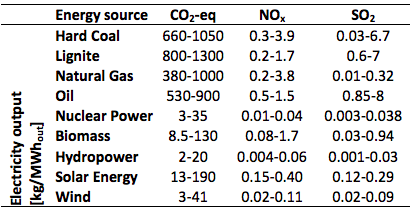

# **CO2 emissions of imported electricity**

## **Introduction**
When a country or region has a (temporal) higher electricity demand than they can produce, the country or region has to import it from elsewhere. This imported electricity is often from neighbouring countries or regions. 

In many cases the imported electricity also caused CO2 emissions due to production, transportation, and other life cycle relate emissions. 

## **Default choice**

The default choice for imported electricity is the Dutch electricity mix: 527 gCO2/kWh or 146,39 gCO2/MJ (<a href="#ref">CBS, 2015</a>). The CBS (National statistical office) has chosen the 'integral method' to calculate the CO2 emissions of the electricity mix. 

The reason to choose the Dutch average is that most datasets of the ETM are regional datasets, which do import mostly electricity from the Dutch grid, which mostly exists of the Dutch electricy mix. If you do not agree with this default value you are free to set a value yourself.

## **Table with optional values**

The European Environment Agency offers an overview of all European Union countries and their CO2/ emission per kWh. On their website you can select a specific country and you can select the average of all the 28 European Union member states in from 1990 til 2014 (<a href="#ref">EEA, 2017</a>). However if you only desire the value of 2014, then you can find it in the following table:

Member State		| gCO2 emissions / kWh
------------- | -------------
European Union (28 countries)| 275.9 
Austria			| 60.1
Belgium			| 211.5
Bulgaria			| 370.1
Croatia			| 136.7
Cyprus				| 683.6
Czech Republic	| 375.8
Denmark			| 	166.6
Estonia			| 762.2
Finland			| 106.4
France				| 34.8
Germany			| 	424.9
Greece				| 829.9
Hungary			| 206.6
Ireland			| 455.6
Italy				| 229.2
Latvia				| 95.4
Liechtenstein		| 	None
Lithuania			| 102.7
Luxembourg		| 268.2
Malta				| 715.3
Netherlands		| 451.4
Poland				| 670.6
Portugal			| 359.5
Romania			| 208.5
Slovakia			| 89
Slovenia			| 178.3
Spain				| 304
Sweden				| 10.5
United Kingdom	| 388.8

Table 1: Table with optional 2014-values by country, from: (<a href="#ref">EEA, 2017</a>)

  
Table with carrier-technology dependent CO2 emissions / kWh, from: (<a href="#ref">Turkoni et al., 2013</a>)

References
----------
- EEA, 2017: https://www.eea.europa.eu/data-and-maps/daviz/co2-emission-intensity-3#tab-googlechartid_chart_11_filters=%7B%22rowFilters%22%3A%7B%7D%3B%22columnFilters%22%3A%7B%22pre_config_ugeo%22%3A%5B%22European%20Union%20(28%20countries)%22%5D%7D%7D 

- CBS, 2015: https://www.cbs.nl/nl-nl/achtergrond/2017/06/rendementen-en-co2-emissie-elektriciteitsproductie-2015

- Turconi et al., 2013: Life cycle assessment (LCA) of electricity generation
technologies: Overview, comparability and limitations. Renewable and Sustainable Energy Reviews, 28, 555-565. DOI: 10.1016/j.rser.2013.08.013
