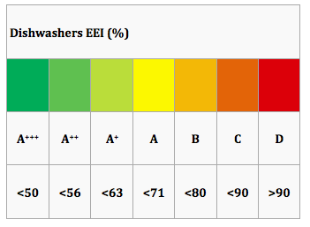
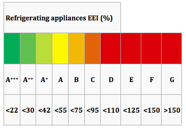
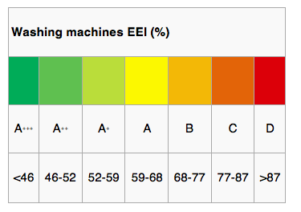
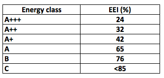
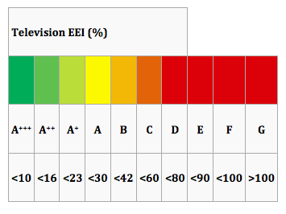
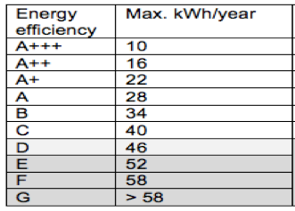

Introduction
------------

Energy consumption labelling can be used in household appliances to determine how efficient they are. The energy labels can range from class A+++ to class D with the A+++ being the most efficient class and D the least efficient class. The ETM allows you to choose the efficiency levels of each appliance in order to define its energy class. You can increase or decrease the efficiency of the appliance with the maximum percentage of reaching the class A+++ and the minimum percentage of reaching the class D. The starting point refers to the current energy label of the appliance. The energy consumption labels defer from appliance to appliance. 
This page discusses the modeling methods used for the implementation of energy consumption labelling in the ETM and the data that underlies the modeling.

Research
--------

The EU established an energy consumption labelling scheme for household appliances and it is necessary for all the manufactures to include it. The energy label can determine the energy efficiency class to a colour code associated with a letter (from A+++ to D), but also can provide further useful information. A more detailed description of the energy labelling of each appliance is described below. 

<strong>Dish washer</strong>

The energy class of the dishwashers can be determined from the Energy Efficiency Index (EEI), which is presented in the table below and it is based on the annual energy consumption of the appliance.

The label also contains information on:


-   the energy consumption in kWh /cycle
-   the washing cycle efficiency class 
-   the drying cycle efficiency class 
-   the capacity as a number of place settings
-   the water consumption in litres per cycle
-   noise in dB(A)

<strong> Fridge/Freezer</strong>


The energy class of the fridge/freezers can be determined from the Energy Efficiency Index (EEI), which is presented in the table below and it is based on the annual energy consumption of the appliance.

The label also contains information on:


-   the annual energy consumption in kWh/year
-   the capacity of fresh foods in litres for refrigerators and combined appliances
-   the capacity of frozen foods in litres for freezers and combined appliances
-   the noise in dB(A)

<strong> Washing machine</strong>


The energy class of the washing machines can be determined from the Energy Efficiency Index (EEI), which is presented in the table below and it is based on the annual energy consumption of the appliance.

The label also contains information on:


-   the annual energy consumption in kWh/year
-   the annual water consumption in litres 
-   the capacity for the standard 60 °C cotton programme at full load or the standard 40 °C cotton programme at full load, whichever is the lower, in kg
-   the spin-drying efficiency class
-   the noise during the washing and spinning phases, for the standard 60 °C cotton programme at full load, in dB(A)

<strong> Dryer</strong>

The energy class of the dryers can be determined from the Energy Efficiency Index (EEI), which is presented in the table below and it is based on the annual energy consumption of the appliance.

The label also contains information on:


-   the annual energy consumption, based on 160 drying cycles of the standard cotton programme at full and partial load, and the consumption of the low-power modes, in kWh/year
-   the type of household tumble drier (air-vented, condenser or gas-fired)
-   the cycle time corresponding to the standard cotton programme at full load, in minutes
-    the capacity for the standard cotton programme at full load, in kg
-   the noise during the drying phase, for the standard cotton programme at full load, in dB(A)

<strong> Television</strong>


The energy class of the televisions can be determined from the Energy Efficiency Index (EEI), which is presented in the table below and it is based on the annual energy consumption of the appliance.

The label also contains information on:


-   the on-mode power consumption in Watts
-   the annual on-mode energy consumption, in kWh/year
-   the visible screen diagonal in inches and centimetres


<strong>Vacuum cleaner</strong>


The energy class of the vacuum cleaners can be determined from Maximun kWh/year, which is presented in the table below. 

The label also contains information on:

-   the annual energy consumption in kWh/year
-   the cleaning performance
-   the dust re-emission in mg/m3

The data on the energy consumption labelling of appliances and the current energy labelling in the Netherlands are based on the following publicly available literature:

-   [http://www.natuurenmilieu.nl/media/998797/factsheet_energy_label.pdf](http://www.natuurenmilieu.nl/media/998797/factsheet_energy_label.pdf)
-   [http://www.topten.eu/uploads/File/deliverables_max/D3.2%20Update_CriteriaPaper_Tumbledriers_final.pdf](http://www.topten.eu/uploads/File/deliverables_max/D3.2%20Update_CriteriaPaper_Tumbledriers_final.pdf) 
-   [http://www.topten.eu/uploads/File/Vacuum%20cleaners_Policy%20Recommendations_Aug_13.pdf](http://www.topten.eu/uploads/File/Vacuum%20cleaners_Policy%20Recommendations_Aug_13.pdf)

and the following websites:

-   [http://eur-lex.europa.eu/legal-content/EN/ALL/?uri=CELEX:32010R1060](http://eur-lex.europa.eu/legal-content/EN/ALL/?uri=CELEX:32010R1060)
-   [http://eur-lex.europa.eu/legal-content/EN/ALL/?uri=CELEX:32010R1061](http://eur-lex.europa.eu/legal-content/EN/ALL/?uri=CELEX:32010R1061)
-   [http://eur-lex.europa.eu/legal-content/EN/TXT/PDF/?uri=CELEX:32010R1062&qid=1395837474289&from=EN](http://eur-lex.europa.eu/legal-content/EN/TXT/PDF/?uri=CELEX:32010R1062&qid=1395837474289&from=EN)
-    [http://www.top10energyefficiency.org.uk/dishwashers](http://www.top10energyefficiency.org.uk/dishwashers)

Modeling
-------

In this section the modeling methods used for the calculation of the energy efficiency change of household appliances are described. 

A new EEI adjusted with the linearization method and used for the calculation of the limits of the energy efficiency change of each appliance. The EEI can specify the limits of the energy consumption of each energy class and it is based on the annual energy consumption of the applinace. 

The starting point refers to the current energy label of each appliance, the maximun value refers to the % change in the energy efficiency of the appliance in order to reach the most efficient energy calss (A+++), and the minimun value refers to the % change in the energy efficiency of the appliance in order to reach the least efficient energy calss (D).

 A more detailed description of the energy efficiency limits are shown in the table below. 
 

||Min. %|Current energy label| Max. % |
|---------|-----|---------------------|
|Dish washer|-34%|A|35%|
|Fridge / Freezer|-132%|A+|66%|
|Washing machine|-54%|A+|28%|
|Dryer|-36%|B|69%|
|Television|-93%|A|92%|
|Vacuum cleaner|-15%|C|75%|

All the appliances have an energy class range from A+++ to D, except from the dryers. The least energy efficient class for the dryers is C. For the simplicity of the calculations, it is assumed that the energy class range for the dryers is also from A+++ to D.

