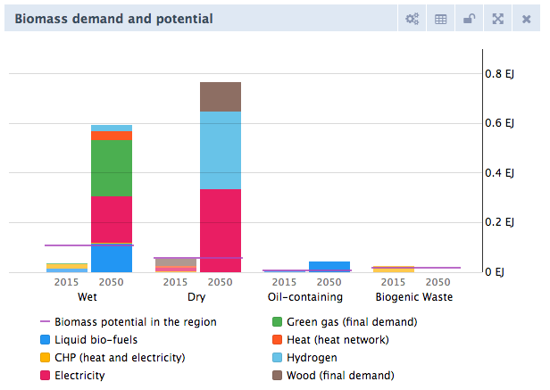
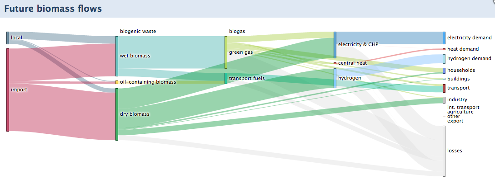

# Biomass

There is a growing interest in using biomass as energy carrier, for instance for heat production, electricity production, transport fuel or as a feedstock for the chemical industry. However, biomass is often grown at the expense of food crops and stimulates deforestation. Careful consideration is required when using large amounts of biomass. The modelling of biomass streams in the ETM has been updated in 2019 in close collaboration with Gasunie, GasTerra, TKI Nieuw Gas and TNO. TNO has supported this project by researching all required data.

Modelling principals
------------

There are many different biomass resource streams; too many to model each one individually. Therefore we have chosen to distinguish these four biomass categories:
-   **Wet biomass**: residues from the food and beverage industry, agricultural residual streams, sewage sludge, aquatic biomass, cultivated grain products, etc. 
-   **Dry biomass**: residual streams from forestry (tree tops, stumps, bark, branches), recycled waste wood, residual streams from agriculture (straw), and fast-growing bio-energy crops (elephant grass, willow, poplar)
-   **Oil-containing biomass**: rapeseed, sunflower seeds, oil palm, used frying fats. 
-   **Biogenic waste**

TNO researched the potential of each biomass category for each country modelled in the ETM. When biomass demand exceeds this potential, then biomass will be imported from outside the region. For the Netherlands TNO researched the potentials in great detail. The potentials of over 30 biomass streams have been quantified and are shown in the last table below. The ETM allows users to adjust maximum biomass potentials for each biomass category with these sliders:

The set potentials are shown in the "Biomass demand and potential" chart along with the total demand of each biomass category. This gives the user a feeling of how much biomass is still regionally available.

Biomass can be used in different places throughout the model: 
- as green gas in the gas network
- in biomass heaters for (local) heat networks
- as transport fuel: bio-ethanol, biodiesel, bio-LNG and biokerosene
- as co-firing in coal plants
- as biocoal or bio-oil in power plants
- to produce hydrogen through gasification

To get a quick overview of all future biomass streams and conversions, there is a sankey-chart visualizing these:

Users can adjust the costs of biofuels with sliders for greengas, biogas, wood, biodiesel and bio-ethanol. The costs that are used in the present year are researched by TNO:

Input data
------------

### Green gas production costs
TNO has researched the production cost for greengas producing technologies and came to the following costs:

|                        |   unit   | Wet gasification \(SCW\) | Dry gasification | Anaerobic digestion |
|------------------------|----------|--------------------------|------------------|---------------------|
| Efficiency             | %        | 70                       | 70               | 48                  |
| Production costs       | EUR/MWh  | 41\.33                   | 75\.79           | 63\.57              |
| Input capacity         | MW input | 20                       | 70               | 8\.33               |
| Investment costs       | EUR      | 19                       | 130              | 4\.7                |
| Fixed yearly O&M costs | EUR/jaar | 3                        | 9\.5             | 0\.23               |

### Dutch biomass potential

TNO has researched the potential biomass production in the Netherlands for 2030 and came to the following total potentials (sorry, in Dutch only):

|                              | unit | wet biomass | dry biomass | oil\-containing biomass | biogenic waste |
|------------------------------|------|-------------|-------------|-------------------------|----------------|
| Dutch biomass potential 2030 | PJ   | 16\.8       | 47\.4       | 10\.5                   | 21\.6          |

These total potentials originate from the following underlying biomassa streams:

| Sector                                                                      | Biomassastroom                          | Categorie | Potentie PJ \(droge stof basis\) | Verdeelsleutel van nationale naar gemeentelijke potentie                                  |
|-----------------------------------------------------------------------------|-----------------------------------------|-----------|----------------------------------|---------------------------------------------------------------------------------------|
| Voedings- en genotmiddelenindustrie                                         | Frituur en restvettten                  | vet       | 10\.5                            | Bevolking                                                                             |
|                                                                             | Natte stromen VGI                       | nat       | 6\.5                             | Cultuurgrond \- Blijvend grasland                                                     |
| RWZI/AWZI\-slib                                                             | Slib RWZI                               | nat       | 3\.52                            | Bevolking                                                                             |
|                                                                             | Slib AWZI                               | nat       | 1\.353                           | Cultuurgrond \- Blijvend grasland                                                     |
|                                                                             | Slib verbrand                           | afval     | 3\.39526                         | Bevolking                                                                             |
| Agrarische reststromen                                                      | Drijfmest                               | nat       | 25                               | Melkkoeien  \+ Varkens                                                                |
|                                                                             | Droge mest                              | droog     | 8\.8                             | Melkkoeien  \+ Kippen                                                                 |
|                                                                             | Stro                                    | droog     | 2\.6                             | Granen \(are\)                                                                        |
|                                                                             | natte gewasresten                       | nat       | 11                               | Akkerbouwgroenten                                                                     |
| Groente\-, Fruit\- en Tuinafval & Organische natte Fractie \(GFT en ONF\) | GFT                                     | nat       | 8\.7                             | Bevolking                                                                             |
|                                                                             | ONF in afval \(nat\)                    | nat       | 1\.8                             | Bevolking                                                                             |
|                                                                             | ONF in afval \(afval\)                  | afval     | 3\.6864                          | Bevolking                                                                             |
|                                                                             | Zeefoverloop                            | droog     | 0\.728                           | Bevolking                                                                             |
| Droge biomassa                                                              | Resthout uit houtverwerkende industrie  | droog     | 5\.32                            | Bevolking                                                                             |
|                                                                             | afvalhout                               | droog     | 19\.76                           | Bevolking                                                                             |
|                                                                             | afvalhout particulier                   | droog     | 2                                | Bevolking                                                                             |
|                                                                             | Papierresiduen                          | afval     | 2\.3                             | Bevolking                                                                             |
|                                                                             | Papier in afval                         | afval     | 12                               | Bevolking                                                                             |
| Nederlandse productiebossen                                                 | Productiebos                            | droog     | 3\.2                             | Bos \(ha\)                                                                            |
|                                                                             | Productiebos particulier                | droog     | 4                                | Bevolking                                                                             |
|                                                                             | Korte omloop bomen                      | droog     | 0\.000855                        | Totaal agrarisch terrein                                                              |
|                                                                             | Korte omloop bomen \(bijschatting TNO\) | droog     | 0\.38                            | Totaal agrarisch terrein                                                              |
|                                                                             | Import/onbekend particulier             | droog     | 2                                | Bevolking                                                                             |
| Natuur en landschapsbeheer                                                  | Hout van fruit\- en boomteelt           | droog     | 0\.396                           | Totaal agrarisch terrein                                                              |
|                                                                             | Hout uit landschap                      | droog     | 4\.752                           | Totaal gemeentelijke en waterschapswegen \(km\) \+ Park en plantsoen \(ha\)           |
|                                                                             | Tuin/landbouw/openbaar groen            | droog     | 7                                | Bevolking                                                                             |
|                                                                             | natuurgras\+bermgras                    | nat       | 5                                | Totaal gemeentelijke en waterschapswegen \(km\) \+ Bos \(ha\)                         |
|                                                                             | Heide                                   | droog     | 0\.023375                        | Open droog natuurlijk terrein                                                         |
| Aquatische biomassa                                                         | Riet en andere waterplanten             | nat       | 18                               | Open nat natuurlijk terrein \+ Recreatief binnenwater \+ Overig binnenwater           |
|                                                                             | Microalgen                              | nat       | 1\.5                             | Totaal agrarisch terrein                                                              |
|                                                                             | Zeewier                                 | nat       | 12                               | Bevolking                                                                             |
| Energieteelt                                                                | Totale natte energieteelt               | nat       | 3\.5                             | Totaal agrarisch terrein                                                              |
|                                                                             | Totale droge energieteelt               | droog     | 1\.2                             | Totaal agrarisch terrein                                                              |
|                                                                             | Grassoorten op zoute grond              | nat       | 12                               | Noord Beveland 10% Veere 20% Vlissingen 10% Middelburg 10% Texel 10% Het Hogeland 40% |

The Dutch national potentials were subdivided to municipal potentials by using the 'verdeelsleutel' for each individual biomass stream from the most right column in the table above. 

These sources have been mainly used for researching the biomass potential:
- Koppejan, J., W. Elbersen, M. Meeusen, P. Bindraban (2009): Beschikbaarheid van Nederlandse biomassa voor elektriciteit en warmte in 2020. Procede Biomass BV, Enschede, november 2009  https://www.rvo.nl/sites/default/files/bijlagen/Beschikbaarheid%20van%20Nederlandse%20biomassa%20voor%20warmte%20en%20elektriciteit%20in%202020.pdf
- Schulze, P., J. Holstein, H. Vlap (2017) Biomassapotentieel in Nederland. Verkennende studie naar vrij beschikbaar biomassapotentieel voor energieopwekking in Nederland. GCS.17.R.10032629.2, DNV-GL, Arnhem, 6 april 2017
https://www.fluxenergie.nl/wp-content/uploads/2017/04/DNVGL_Rapport_Biomassabeschikbaarheid-in-Nederland.pdf
- Boosten, M., J. Oldenburger, J. Kremers, J. van den Briel, N. Spliethof, D. Borgman (2018): Beschikbaarheid van Nederlandse verse houtachtige biomassa in 2030 en 2050. Studie naar binnenlands potentieel en toekomstige vraag vanuit energie en biobased ontwikkelingen. Probos, Wageningen, juni 2018.https://www.rvo.nl/sites/default/files/2018/07/Beschikbaarheid-van-Nederlandse-verse-houtige-biomassa-in-2030-en-2050.PDF
