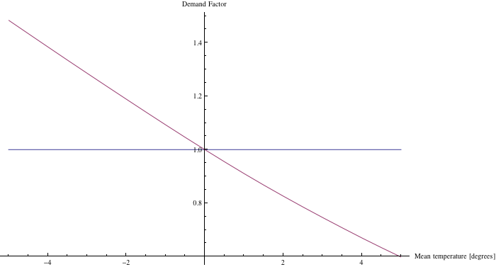
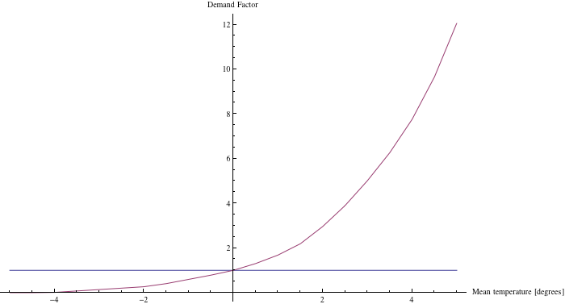
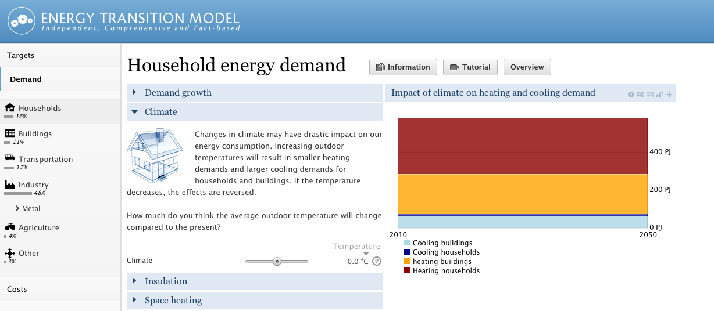

Introduction
------------

In recent years, the evidence for human-induced climate change has been accumulating [1](http://en.wikipedia.org/wiki/Global_warming). Climate change has a direct impact on the useful demand for heating and cooling of households and buildings. When the average outdoor temperature rises, the useful demand for heating decreases and the useful demand for cooling increases. Useful demand for heat is the amount of heat needed for space heating, not how much gas or electricity is consumed to make that heat (final demand). These effects are reversed for a drop in average outdoor temperature. Currently, the climate impact is only calculated in the ETM for the Netherlands.

### Modeling

The impact of climate change on the useful demand of heating and cooling of households and buildings has been modeled in the ETM based on three main assumptions:

1.  Climate change can be represented by a shift in outdoor temperature (the corresponding slider varies between -5 and +5 degrees centigrade)
2.  The change in useful demand for heating and cooling is directly related to a change in degree-days [2](http://en.wikipedia.org/wiki/Degree_day)
3.  Houses and buildings will be heated if the outdoor temperature falls below 18 degrees centigrade and cooled when it rises above 23 degrees centigrade

To find the relation between the average outdoor temperature and the degree-days we have used temperature measurements from the observatory at "De Bilt" in the Netherlands for the year 2010. Figure 1. below shows these temperature measurements in degrees centigrade. Also plotted are the threshold temperatures above and below which we assume cooling and heating is required.

.")

To calculate degree-days for a given temperature threshold, the area between the threshold temperature and the curve is integrated. For heating this is the area **under** the 18 degree threshold and **above** the curve. These two (both heating and cooling) surface areas are shaded blue in Figure 1. Shifting the whole curve up (for increasing outdoor temperatures) or down (for decreasing outdoor temperatures) changes the shaded areas and thus the degree-days. The Figures below show the surface areas for heating (left Figure) and cooling (right Figure) as a function of temperature change (with respect to the 2010 average).

We note that the effects of insulation are taken into account separately in the ETM. The slider described in this text, directly changes the useful demand for heating and cooling and the resulting useful demand can be (further) diminished by effects of insulation, ventilation, heat-recovery etc.

 

The functional relations described above are used to scale the useful demand for heating and cooling. For heating the functional relation is almost linear. For cooling, it is strongly non-linear with demand almost vanishing for a 5 degree drop in temperature and increasing more than tenfold for a five degree increase. This is a result of the fact that the cooling threshold temperature is only slightly below the maximum temperature measured at De Bilt (see Figure 1.). The surface area (and thus the degree-days) associated with cooling essentially describes the high temperature 'peak' of the temperature curve and is therefore very sensitive to temperature changes.

### Interface

To explore the effects of climate change on the useful demand for heating and cooling in buildings and households, the ETM has been extended with a slide called 'Climate' (see Demand \> Households \> Climate). Figure 4. shows the the climate slide for the start scenario. 
