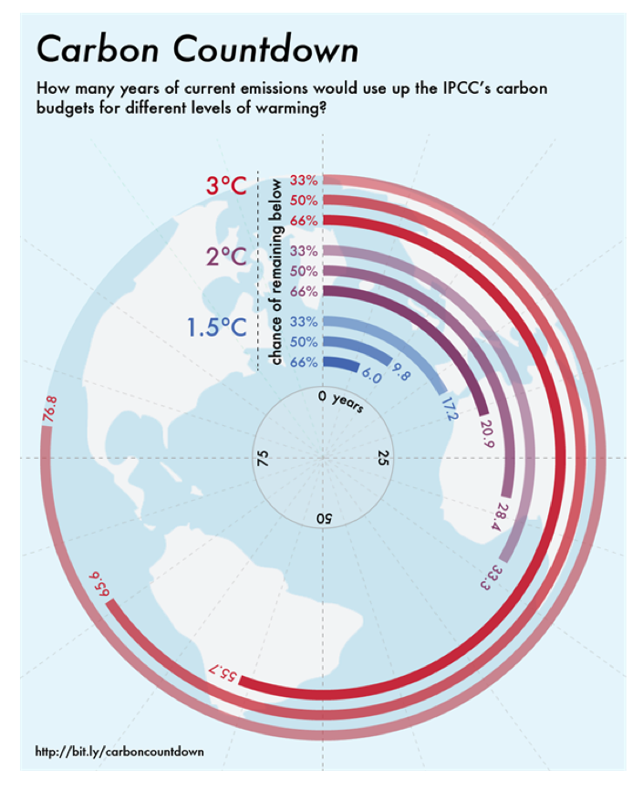
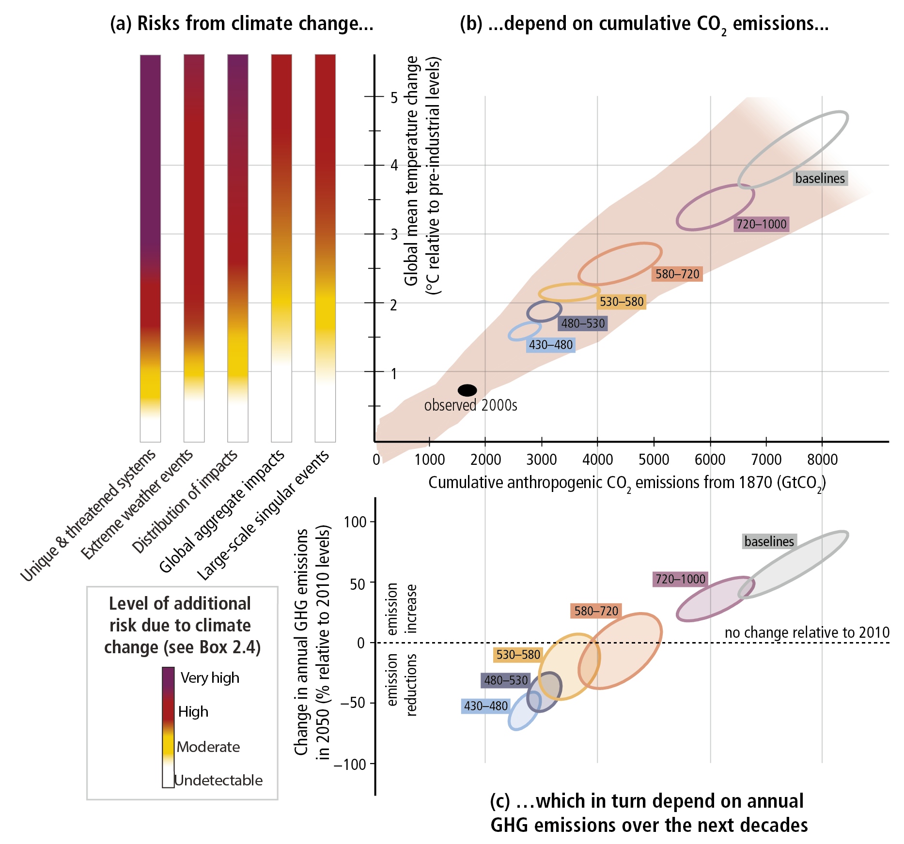
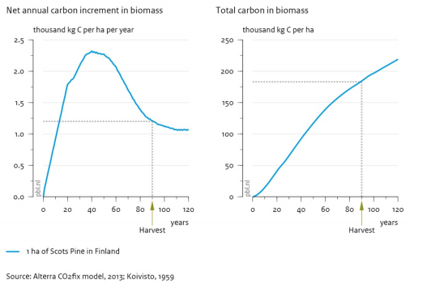
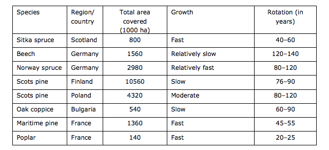
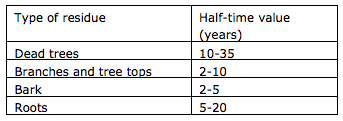

# Climate relevant CO2 emissions from biomass

Climate change is not induced by the annual CO2 emissions, but by the total amount of CO2 present in the air. Virtually any form of combustion contributes to the amount of CO2 in the air.

Usually no CO2 emissions are attributed to biomass as biomass absorbs as much CO2 as is emitted during combustion (over the complete life cycle). The life cycle of biomass varies from a couple of months to over a century. To have a 66% chance of remaining below a temperature rise of 2 oC roughly 20 years of current emission can be emitted. Exceeding this temperature increase can have irreversible consequences. The CO2 emitted by combustion of biomass is not always absorbed within a time-scale that is relevant for climate change.

Which part of the CO2 emissions from biomass is relevant to the environment is uncertain and speculative. With the ETM the potential CO2 emission from combustion of biomass can be explored. 

This part of the documentation provides background information on carbon budget, carbon debt, considerations for various types of biomass and policy.

Background
-------------
### Carbon budget
The IPCC has quantified global **carbon budgets**, for various scenario's of climate change (<a href="#ref">IPCC, 2013</a>). The budgets estimate the amount of CO2 we can still emit while having a likely chance of remaining within a certain level of temperature rise (1.5 oC, 2 oC, 3 oC) with respect to pre-industrial levels.

The carbon budget which gives a likely chance (> 66%) of remaining within a temperature rise of 2 oC will be used up with 20 years of the current annual CO2 emission. 

How many years of current emissions would use up the IPCC's carbon budgets for different levels of warming? (<a href="#ref">Carbon Brief, 2014</a>)

The risk of climate change depends on the cumulative CO2 emissions which in turn depend on the annual greenhouse gas emissions. To remain within a temperature rise of 1.5 oC in 2050 a CO2 reduction of roughly 50% is needed.

The relationship between risks from climate change, temperature change, cumulative carbon dioxide (CO2) emissions and changes in annual greenhouse gas (GHG) emissions by 2050. (<a href="#ref">IPCC, 2014</a>)

### Carbon debt
Carbon debt is created when biomass is used for energy production. In short, CO2 is emitted instantaneously whilst the regrowth of biomass takes time. Furthermore direct emission levels of biomass are sometimes higher than the emissions of fossil fuels. Diminishing carbon stock by land-use change can also contribute to carbon debt. (based on: <a href="#ref">PBL/Alterra, 2013</a>)

### Land-use change
Changes of land-use can either be direct or indirect. An example of direct land-use Change (LUC) is the cutting down of a forest to grow biomass on the created farmland. When, for example, farmland for food is converted into farmland for biomass and the food production is moved to forest-converted farmland there is Indirect Land-Use Change. (Based on: <a href="#ref">EC, 2010</a>). The United Nations Framework Convention on Climate Change (UNFCCC) refers to LUC and ILUC as "land-use, land-use change and forestry" (LULUCF).

Types of biomass
----------------
The typical life cycles of the three types of biomass (gaseous, liquid and sold) differ a lot; they are therefor treated separately in the ETM. 

### Gaseous biomass
Gaseous biomass can be produced through fermentation and gasification. Most common is production of biogas from (wet) biomass through (anaerobic) fermentation. This (wet) biomass consists of organic material such as biodegradable waste, sludge, waste from landfills, industrial residues and animal waste products (for example cow manure).

CE Delft carried out a study regarding the sustainability of biomass. They concluded that: "Biogas based on manure or residual flows (roadside grass, natural, organic waste and sewage sludge) scores (very) well on sustainability aspects. Biogas based on manure scores extra well because emissions in the chain are reduced. Biogas from raw materials which are also used as animal feed do not score well on sustainability criteria. It is possible that use of these commodity chains for biogas production leads to additional emissions." (translated <a href="#ref">CE Delft, 2013</a>).

Gasification of solid biomass is still uncommon. The climate impact may be higher than that of fermentation because the life cycle of solid biomass is longer than that of wet biomass (waste) streams. More information about the life cycle of solid biomass can be found below.

### Liquid biomass
The raw materials for liquid biomass (corn, sugar beet, palm) are commonly grown agricultural. The life cycle of this biomass is short (<1 year). However, the risk of (indirectly) Land Use Change is large. Policies and guidelines seek to reduce this risk through policies and guidelines. More information about policies can be found below.

### Solid biomass
An important aspect of using wood for energy is that wood growth and natural decay both take time whilst, when the wood is used for energy, CO2 is emitted almost instantaneously. Final felling and replanting a forest, for example, reduces the uptake of CO2 as mature forests grow faster than young forests. After final felling, CO2 fixation rates are initially relatively low, but increase again as forests regrow. Regrowth after logging takes 20 to 100 years (for example poplar grows fast, birch and pine have a long regrowth-time).

Typical carbon increment curves for an even-aged stand of trees (<a href="#ref">PBL/Alterra, 2013</a>)

Typical specifications of various wood species (<a href="#ref">PBL/Alterra, 2013</a>)

Use of pruning and waste wood accelerates the natural decomposition process. Typical half-lives for natural decay in forests ranges from 2-5 years for bark to 10-35 years for dead trees.

Typical half-time values (in years) for the decay of wood residue in forests (<a href="#ref">PBL/Alterra, 2013</a>)

 
There are also tree-species with a short rotation. Willow has an rotation cycle of several years. Using this type of biomass however involves risk of land change (LUC and ILUC).

Policy
------

### Policy in Europe
The Renewable Energy Directive (RED, <a href="#ref">European parliament, 2009</a>) establishes an overall policy for the production and promotion of energy from renewable sources in the EU. **The RED sets out biofuels sustainability criteria** for all biofuels produced or consumed in the EU to ensure that they are produced in a sustainable and environmentally friendly manner. These criteria account for direct land-use change, but do not account for indirect land-use change. In 2015 an amendment was added to RED to reduce the risk of indirect land-use change (<a href="#ref">European parliament, 2015</a>).

Sustainability criteria must be met by all biofuels, whether produced within the EU or imported, and must meet a 35% GHG emission savings requirement compared to fossil fuels. As of 2017, the threshold is set to rise to 50% and to 60% by 2018, for new installations. In this comparison the complete life cycle is taken into account. The reduction in carbon stock (cause by LUC) is calculated and spread over 20 years. CO2 emissions caused by combustion of biomass are set to 0 in the calculations. 

**RED does not set out criteria for solid or gaseous biomass.** However, as part of the new Renewable Energy Directive (RED II) for the post 2020 period, the EC is developing a new bioenergy policy expected to be made public in the last quarter of 2016. The legislative proposal on a renewable energy target for 2030 will include sustainability criteria for both biofuels and biomass (<a href="#ref">USDA, 2016</a>). 

### Policy in The Netherlands
The Netherlands generally follows EU policy when it comes to sustainability. So, for the use of liquid biofuels binding requirements are in place. There are currently no obligatory sustainability criteria for solid and gaseous biomass. A voluntary standard, NTA 8080, is available for organizations that can demonstrate that the biomass they use is sustainable. 

In the National Energy Accord (Nationaal Energieakkoord) was agreed that sustainability criteria will be formulated to encourage the use of biomass in coal-fired plants. It was agreed that this is done taking into account aspects such as carbon debt, ILUC and conditions for responsible forestry. In April concept regulation was submitted that restricts SDE+ subsidies to woody biomass that has been produced sustainably (<a href="#ref">EZ, 2016</a>).

References

----------

- Carbon Brief, 2014: [Six years worth of current emissions would blow the carbon budget for 1.5 degrees](https://www.carbonbrief.org/six-years-worth-of-current-emissions-would-blow-the-carbon-budget-for-1-5-degrees)

- CE Delft, 2013: [Hoe Duurzaam is biogas?](http://refman.energytransitionmodel.com/publications/2046), H.J. (Harry) Croezen, I.Y.R. (Ingrid) Odegard, G.C.(Geert) Bergsma, Publicatienummer: 13.2905.63.

- EC, 2010: [REPORT FROM THE COMMISSION
on indirect land-use change related to biofuels and bioliquids ](http://refman.energytransitionmodel.com/publications/2045), COM(2010) 811 final.

- EZ, 2016: [Besluit conformiteitsbeoordeling vaste biomassa voor energietoepassingen](http://refman.energytransitionmodel.com/publications/2050)

- European parliament, 2009: [Directive (EU) 2009/28/EC](http://refman.energytransitionmodel.com/publications/2048).

- European parliament, 2015: [Directive (EU) 2015/1513](http://refman.energytransitionmodel.com/publications/2047).

- IPCC, 2013: [Summary for Policymakers](http://refman.energytransitionmodel.com/publications/2043). In: Climate Change 2013: The Physical Science Basis. Contribution of Working Group I to the Fifth Assessment Report of the Intergovernmental Panel on Climate Change [Stocker, T.F., D. Qin, G.-K. Plattner, M. Tignor, S.K. Allen, J. Boschung, A. Nauels, Y. Xia, V. Bex and P.M. Midgley (eds.)]. Cambridge University Press, Cambridge, United Kingdom and New York, NY, USA. 

- IPCC, 2014: [Climate Change 2014](http://refman.energytransitionmodel.com/publications/2042): Synthesis Report. Contribution of Working Groups I, II and III to the Fifth Assessment Report of the Intergovernmental Panel on Climate Change [Core Writing Team, R.K. Pachauri and L.A. Meyer (eds.)]. IPCC, Geneva, Switzerland, 151 pp.

- PBL/Alterra, 2013: [Climate effects of wood used for bioenergy](http://refman.energytransitionmodel.com/publications/2044), PBL publication number 1182,
Alterra report 2455. The Hague: PBL Netherlands Environmental Assessment Agency.

- USDA, 2016: [EU Biofuels Annual 2016](http://refman.energytransitionmodel.com/publications/2049)
