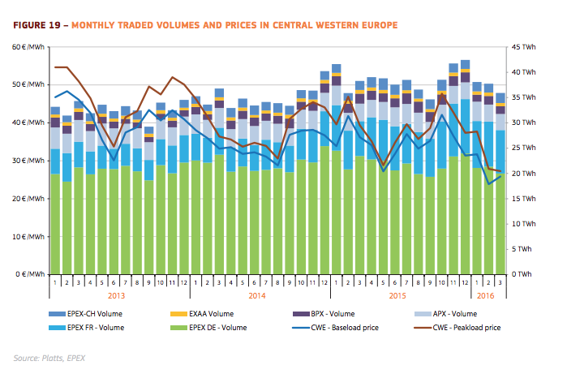

# **Costs of imported electricity**

## **Introduction**
When a country or region has a (temporal) higher electricity demand than production electricity needs to be imported from neighbouring countries or regions. 

The imported electricity has also created costs in this neighbouring country or region. 

## **Default settings**

The default setting for the costs of imported electricity is the average costs of Central West European (CWE) electricity mix: 35 €/MWh or 3.5 ct/KWh. This is a rough estimate from the Quarterly Report on European Electricity Markets
(<a href="#ref">European Commission, 2016</a>). 

The reason to choose the CWE average of 2015 is that most datasets of the ETM are 2015 datasets and that the electricity market is a European market. Also the market prices fluctuate a lot, however the do seem to average around 35 €/MWh in 2015. In the ETM the user can overwrite this default setting for the future situation.

## **Chart with optional values**

We offer you a chart to support your choice. Chart 1 shows the montly electricity prices at the CWE market. 

**CWE montly electricity prices**

Chart 1 shows the CO2 emissions of some carrier-technology combinations.
  

  
Chart 1: Montly electricity volumes and prices at the Central Western European market between January 2013 and March 2016 (<a href="#ref">European Commission, 2016</a>)

**References**
----------
- European Commission, 2016: Quarterly Report on European Electricity Markets; https://ec.europa.eu/energy/sites/ener/files/documents/quarterly_report_on_european_electricity_markets_q4_2015-q1_2016.pdf; https://refman.energytransitionmodel.com/publications/2079  
