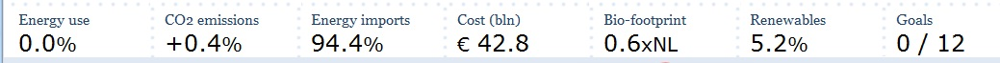

The dashboard in the Energy Transition Model is the overview at the bottom of the page, which contains information on the most essential performance indicators of the scenario. The user can click on each of the indicators in the dashboard to get a pop-up with detailed information on each of the subjects. This page explains both the number indicator and the pop-up window.

As of November 2011 the dynamic dashboard has been introduced. Users can now customize the dashboard they see in the model by clicking 'Change' at the bottom right of the dashboard. 

Energy use
----------

*Main article: [Primary energy](primary_energy.md)*

The chart shows the total primary energy consumption resulting from the total final consumption. This includes primary consumption that results from final non-energy consumption. It does not include primary consumption that results from exports. (This also means that the losses which are typically incurred in the conversion sector are only included for the part of the inland final consumption, not for the exports)

For more information on the primary energy calculation click [here](primary_energy.md).

CO2 emissions
------------------------

*Main article: [CO2 calculations](CO2 calculations "wikilink")*

The percentage shows the change in CO2 emissions between 1990 and the scenario year. The chart shows the CO2 emissions in 1990, in the current year and in the scenario year. The target CO2 emissions is set by the user in the section "goals - sustainability targets".

CO2 emissions shown here are the total *energetic* CO2 emissions resulting from the total final *energy* consumption. This does not include CO2 emissions from final non-energy consumption, fugitive emissions, industrial process, solvent and other product use, agriculture, LULUCF, and other. It also does not include CO2 emissions resulting from exports. The CO2 emission reduction of CO2 capture and storage is taken into account.

 The 1990 value is taken from [area data](area data "wikilink"). The values for the current year and the scenario year are calculated. For more information on the CO2 emission calculation click [here](CO2_calculations "wikilink").

Energy imports
--------------

*Main article: [Import calculations](Import calculations "wikilink")*

The percentage is the net amount of imported primary energy (imports - exports) divided by the total primary consumption. The total primary consumption includes the conversion losses incurred from generation of electricity that is exported. (this approach is sometimes called the 'territorial' approach, as opposed to the 'final consumption' approach)

The chart shows the net imported amount (net export is negative) of each primary energy carrier and the sum of all carriers in a waterfall type chart. The left chart is for the current year, and the right chart is for the scenario year.

Cost
----

*Main article: [Cost calculations](Cost calculations "wikilink")*

The number shows the total yearly cost of energy supply in your region in the scenario.

The chart shows the these costs both for the current situation (left) and the scenario (right). It also shows the contribution to the costs from the supply of heat, supply of electricity, supply of transport fuels, and the supply of non-energetically used fuels (for example feedstock in the chemical industry, or oil used as lubricant in the transport sector).

The value is in current year's euros. It includes the costs of the primary energy carriers and the costs of all the plants that produce electricity and / or heat. Click [ here](Index#Cost_calculations "wikilink") for more information on the cost calculation.

Costs per household
-------------------

*Main article: [Cost calculations](Cost calculations "wikilink")*

The number shows the total yearly cost of energy supply divided by the number of households.

The chart shows the these costs both for the current situation (left) and the scenario (right). It also shows the contribution to the costs from the supply of heat, supply of electricity, supply of transport fuels, and the supply of non-energetically used fuels (for example feedstock in the chemical industry, or oil used as lubricant in the transport sector).

The value is in current year's euros. It includes the costs of the primary energy carriers and the costs of all the plants that produce electricity and / or heat. Click [here](Index#Cost_calculations "wikilink") for more information on the cost calculation.

Bio-footprint
-------------

*Main article: [Footprint calculations](Index#Biofootprint_calculations "wikilink")*

The number shows how much arable land you need to grow the biomass used in your scenario expressed in multiples of your region's total *arable land* area (taken from "Area\_data"). Biomass includes solid biomass, biofuels (liquid), and biogasses (including green gas).

The graphic shows the necessary arable land for both the current year, and the scenario, by blue pictures of your region. Be aware that 1 blue picture of your region means that you need 1 times the *arable land* area of your region, **not** 1 times the total area of your region to grow the biomass.

For more information on the calulation of the bio-footprint click [here](Index#Biofootprint_calculations "wikilink").

Renewables
----------

*Main article: [Renewables](Renewables "wikilink")*

The number shows the percentage of final *energy* consumption that is supplied by renewable sources in the scenario.

The chart shows this percentage both for the current situation and the scenario. The percentage for the current situation is also calculated by the ETM. This percentage may be slighty different from the number in official statistics due to a different definition or due to necessary simplifications in the ETM. The main article [renewables](renewables "wikilink") provides more information on these differences.

Renewable electricity
---------------------

*Main article: [Renewables](Renewables "wikilink")*

The number shows the percentage of final *electricity* consumption that is renewably produced. The calculation uses the definition as used by the European Commission (Directive [2009/28/EC](http://eur-lex.europa.eu/LexUriServ/LexUriServ.do?uri=Oj:L:2009:140:0016:0062:en:PDF)). Also see the main article for more information.

The chart shows this percentage both for the current situation and the scenario. The percentage for the current situation is also calculated by the ETM. This percentage may be slighty different from the number in official statistics due to a different definition or due to necessary simplifications in the ETM. The main article [renewables](renewables "wikilink") provides more information on these differences.

Goals
-----

*Main article: [Goals](Goals "wikilink")*

The numerator in this fraction shows the number of targets met in the scenario, while the denominator shows the total number of targets that can be set.

The pop-up shows a list of all targets with the goals set and the value in the current scenario. When a goal is met the red X in front of the target changes in a green V. The goals shown here are the users own goals which he can change under the tab "[Goals](Goals "wikilink")" on top of the screen.

Loss of load
------------

*Main article: [Electricity backup](Electricity backup "wikilink")*

The loss of load dashboard item shows the probability that electricity production capacity is less than expected demand. The loss of load probability is calculated by comparing the peak electricity demand of a country with the installed capacity. In this calculation, consideration is also given for the variability of volatile electricity production (i.e. Solar PV and wind turbines).

The pop-up shows the peak electricity demand as well as the installed electricity production capacity. The installed capacity is split into reliable and unreliable capacity. The unreliable capacity is capacity from volatile energy sources which is not available at all times of the day and/or year. To avoid a non-zero loss of load probability it is important that there is sufficient reliable capacity to meet the peak electricity demand, for example by adding gas CCGTs to function as backup for volatile electricity production.
