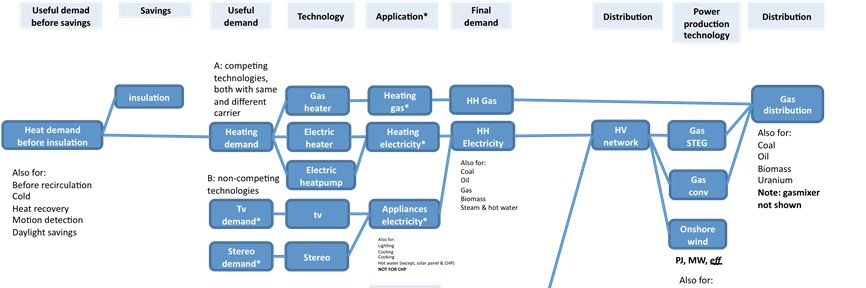

# Detailed documentation

Introduction
------------

The Energy Transition Model (ETM) allows the user to explore the future of the energy system in several different geographical regions. The model starts out with the current energy situation in the region, based on extensive research by Quintel and its partners. Select a region, a future year and a difficulty level to start the model. It will start without any changes to the present day energy system. The user can then use sliders to input assumptions about how the system will change in the future. The ETM immediately calculates the results of any measures taken and presents it to the user using graphs and a dashboard. In this way a user can create a scenario that showcases a possible future energy system.

The model consists of 5 major areas:

-   **[Targets](targets.md):** where users set their policy targets that they are later evaluated against
-   **[Demand](demand.md):** where users set the future demand of energy in 6 economic sectors (households, non-residential buildings, transport, industry, agriculture and other)
-   **[Flexibility](flexibility.md):** where users set the technologies to deal with excess electricity
-   **[Supply](supply.md):** where users set how and what energy is supplied in the future
-   **[Costs](costs.md):** where users specify their estimations of future energy costs

The model uses data on energy consumption and production and present day state-of-the-art technology data. The use of underlying assumptions has been minimized and assumptions about changes in the future are left to the user as much as possible. With the sliders in the interface a user can influence the future state of the model. If no slider is available to set a certain change in the future, no assumption is made by the ETM.
**Note:** The user is responsible for the internal consistency of all assumptions, as no automatic correction of inconsistent assumptions takes place.

The energy system is approached as an ‘energy flow’ or Sankey diagram based on a network of interconnected ‘energy converters’. Energy converters convert energy carriers into other energy and losses, for example a gas heater converts gas into heat and loss. This network of converters is called a ‘graph’. The ETM uses two graphs, a static one for the present and a dynamic one for the future situation; the latter can be influenced using the sliders in the interface. The model does not calculate transition paths and does not take into account feedback loops (e.g. high costs do not depress demand).

Interface
---------

*Main article: [Interface](interface.md)*

### Layout

The layout of the ETM is based on its five main topics (Targets, Demand, Flexibility, Supply and Costs), which are located in the tabs at the left of each page. Each main topic is divided into several sub-topics. These are are described further on the dedicated pages of each main topic.

#### Targets

*Main article: [Targets](targets.md)*

Allows the user to set targets for sustainability, dependence on other countries for energy, costs of energy and the maximum area use for renewable technologies. These targets are not used as input to the ETM's calculations and do not set hard boundaries in the model. They allow the user to see for which areas he is meeting his targets and for which he needs to make a bigger effort to achieve them.

#### Demand

*Main article: [Demand](demand.md)*

Allows the user to change the way energy is used and what energy demand will be in the future in the sectors: Households, Non-residential buildings, Transport, Industry, Agriculture and Other.

#### Flexibility

*Main article: [Flexibility](flexibility.md)*

Large amount of volatile electricity producertion will most likely result in times when supply exceeds demand. In order to deal with this excess electricity, the user can install several flexibility technologies like batteries and power to gas. 

#### Supply

*Main article: [Supply](supply.md)*

Allows the user to determine which technologies are used for central electricity and heat production and also how green transport fuels will be.

#### Cost

*Main article: [Costs](costs.md)*

Allows the user to input his assumptions on how costs for fuels, electricity production technologies and CO2 emission will change.

### Charts

The charts on the right hand side of the page directly show the result when a slider is changed. The charts provide insight in the energy system by showing figures of the current situation as well as of the scenario you are creating. The transition path in the charts is only an indication of the development, as the values between the current year and the scenario year are solely an interpolation between the figures of the two years.

Specific charts are explained further in the explanation of the interface. In the main article the different chart types are explained in more detail.

### Dashboard

*Main article: [Dashboard](dashboard.md)*

The dashboard is the row of numbers at the bottom of each page. It shows the most important indicators for your scenario at a glance. As of November 2011 it is possible to customize the dashboard by clicking 'Change' at the bottom right side of the dashboard in the ETM. The indicators currently available for the dashboard are:

-   Energy use: Percentage difference in primary energy use between current situation and scenario
-   CO2 emissions: Percentage difference in energetic CO2 emissions due to final energy consumption between 1990 and the scenario year
-   Domestic CO2 emissions: Percentage difference in energetic CO2 emissions due to final energy consumption between 1990 and the scenario year, excluding the CO2 emissions of imported electricity
-   Energy imports: Share of primary energy that is imported
-   Loss of load: Indicator showing the chance that production capacity is less than demand
-   Cost: Total yearly cost of energy supply in current year's euros
-   Costs per home: The total yearly cost of energy divided by the number of households
-   Employment: Percentage difference in local employment between the start year and the scenario
-   Profitable plants: Percentage of plants installed in the scenario that make a profit as calculated by the merit order calculation
-   Bio-footprint: Land area necessary to grow all the biomass used compared to the arable land in your country
-   Renewables: Percentage of final energy consumption that is renewable
-   Renewable el.: Percentage of final energy consumption that is renewably produced
-   Targets: Indicator showing how many of your own preset targets you have reached in the scenario

You can click on each of the indicators in the dashboard to get a pop-up with detailed information on each of the subjects. For more information on the dashboard items see the main article on the Dashboard.

Modeling logic
--------------

### No feedback

The model is linear and does not use feedback loops (it is not an equilibrium model). This also means that demand and supply are not dependent on prices. The user sets the demand, cost and supply parameters independently and is responsible for internal consistency. This is done deliberately, so the user may learn:
1. How sensitive critical outcomes are to even slight variations in assumptions for the future
2. Which particular assumptions for the future most impact the user's particular interests

### Calculation

The ETM calculates the energy consumption and associated parameters such as costs and CO2 in a bottom up fashion starting from what is called 'useful demand', via 'final demand' to 'primary demand'.
[Useful demand](useful_demand.md) is the demand for heat for heating houses, or for transportation, for example.
**Final demand** is the consumption of energy carriers in order to meet useful demand, e.g. gas for heating houses or gasoline for transportation.
**Primary demand** is the consumption of primary energy carriers, some of which may be converted to other carriers, e.g. coal converted into cokes or mineral oil into oil fractions like gasoline.
 The ETM uses the following approach to calculate how useful demand determines demand for primary energy carriers:

-   The energy system is approached as an ‘energy flow’ or Sankey diagram based on a network of interconnected ‘energy convertors’ with links (or edges) between them.
    -   Energy converters convert energy carriers into other energy and losses, examples are gas heaters, electric cars, nuclear power plants, power lines etc. All converters have [attributes](converter_attributes.md) assigned.
    -   The network of converters is called a ‘graph’. A partial schematic version is shown below (to be read from left to right).
    -   The ETM uses two graphs, a static one for the present and a dynamic one for the future situation; the latter can be influenced using the sliders in the interface.

\* The ETM calculates both the present and future situations with supplied input data for the present, energy converter attributes (like efficiency, costs, etc) and sliders settings for the future

-   NO transition paths are calculated
-   Calculation occurs ‘bottom-up’ or 'left-to-right' from useful demand to primary energy consumption
-   When the graph for the present is constructed, the system is fixed on final energy consumption. This is the most well-known and reliable quantity in most energy systems (economies)
    -   Associated primary energy use is determined by converter attributes as mentioned above (e.g. power plant efficiencies, electricity mix, etc)
    -   Associated useful energy demand is estimated based on input data set, e.g. the mix of technologies used to supply household heating

### Balance of energy

The system maintains a balance between demand and supply as follows:

-   Surplus or shortage of electricity is exported/imported via available grid interconnectors
-   Surplus or shortage of other primary energy carriers is imported or exported without limitations, with the exception of lignite, which cannot be exported. Only small regions like cities can import/export heat (see **Region** below).
-   For now, a forward curve for domestic primary energy carrier production is used as input, to predict how much of each primary carrier to import to meet demand

### Region

The ETM considers each region as a separate energy system or economy. This system is connected to the outside world and imports shortages and exports surpluses. For a city, province or federal state a 'parent region' can be assigned. The ETM can take existing parent scenarios (combination of all sliders settings) into account when importing electricity, for example, so it knows how much CO2, renewability and cost are associated with the imported electricity.

### Research and modeling

Input data are based on extensive research of a region's energy statistics, but also of state-of-the-art technologies for energy production, prices and characteristics of energy carriers and more. Data are always taken from publically available written sources, if possible, and are otherwise extensively validated with more than one independent expert from the field, preferably with opposing interests. For example: nuclear power plant data was obtained from a utility company exploiting a modern nuclear plant. The data was then verified with various experts opposed to nuclear energy.

Main assumptions
----------------

The ETM uses the following assumptions to limit complexity:

-   The ETM uses a worst-case-scenario approach: present state-of-the-art technology is used for the future without implicit technological development curves
-   The ETM offers limited possibility to influence future efficiencies or other converter attributes with the exception of costs
-   The ETM performs **no** automatic correction of ‘Demand’ assumptions based on ‘Cost’, ‘Supply’ or ‘Goals’ assumptions or vice versa
-   The ETM calculates without taxes or subsidies as it uses costs not prices
-   The ETM does not take inflation into account, all costs are in 2010 Euros
-   Time value of money is taken into account
-   Each convertor has average/representative attributes based on actuals, which are validated by our partners and based on published data where possible

Calculations
------------

The ETM performs a number of calculations each time the user alters a slider. First, the energy balance in the model is recalculated, after which a number of secondary calculations is performed. Here, an overview of the different calculation types is given.

### Energy flow calculations

The energy flow calculations are the most important calculations in the model, as all other calculations are related to these calculations. The model calculates the flow of energy through the entire network of converters (or, equivalently: vertices, nodes), which calculates the [primary demand](primary_energy.md) based on the [useful demand](useful_demand.md) and how these are provided. When this initial calculation is completed, the other calculations are done based on the outcome.

### Primary energy calculations

*Main article: [Primary energy](primary_energy.md)*

The model calculates primary consumption associated with the output of a specific converter in a bottom-up fashion: Each converter 'asks' the converter one level higher what the primary consumption of that converter's output is and takes his share. This process continues until it reaches the primary converters. At the primary converters, the primary consumption is determined using the [physical content method](primary_energy.md#physical-content-method). Hence the associated primary consumption can be calculated for every converter, including those that represent non-energetic consumption (for example feedstock in the chemical industry) and those that export energy (currently only electricity is exported).

### CO2 emissions calculations

*Main article: [CO2 calculations](co2_calculations.md)*

The model calculates CO2 emissions for the current year and the scenario year. The CO2 emission for the year 1990 is a fixed number taken from `area data`. The model calculates CO2 emissions associated with the energy output of a specific converter in a bottom-up fashion: Each converter 'asks' the converter one level higher what the CO2 emission of that converter's energy output is and takes his share. This process continues until it reaches the primary converters, where the CO2 emission is calculated on the basis of the energy carriers and emission factors. In this process CO2 emission related to distribution and conversion losses etc. is included.

### Import calculations

*Main article: [Import calculations](import_calculations.md)*

The energy import shows the percentage of energy that is imported from outside of the area. For each area, the input data prescribes the amount of energy that is produced/extracted from within the area for a number of future years. If more energy is produced/extracted than needed, the excess energy is exported (except for steam/hot water). To calculate how large the total imported energy is compared to the total energy use of the area, this total amount of energy import is divided by the total primary energy used in the region. The total primary energy used in the region includes the primary energy used to produce electricity that is exported.

### Cost calculations

*Main article: [Cost calculations](cost_calculations.md)*

The Energy Transition Model calculates the total cost of energy supply for the region. The total cost is broken down in five categories: electricity, heat, (energetic) fuels, non-energetic fuels, and network costs.

-   The costs for electricity includes costs for the fuel, operation and maintenance, financing costs and costs for CO2 emission credits if applicable.

-   The costs for heat producing devices are calculated in the same fashion as those of electricity producing devices. This calculation therefore also entails costs for the fuel, operation and maintenance, financing costs and costs for CO2 emission credits if applicable.

-   The (energetic) fuel costs are based on the final demand of the transportation sector and the given energy carriers costs, and refinery costs.

-   The non-energetic fuel costs are calculated with the final demand of non-energetic fuels and the given energy carriers costs.

-   The network costs include the annual maintenance costs for both the electricity and the gas network. Additional costs that have to be made in case the network has to be improved, due to choices for specific technologies which may affect the infrastructure requirements, are also included here.

The costs are all expressed in current year euros. Inflation is not taken into account. However, the cost of capital is taken into account using a Weighted Average Cost of Capital (WACC) of 10% for power plants and industrial devices, and 6% for household appliances. All costs are without taxes, subsidies, levies etcetera. Most importantly the model calculates *cost* of energy, not the *prices* of energy for specific stakeholders.

### Employment calculations

*Main article: [Employment](employment.md)*

The Energy Transition Model calculates the change in employment (in units of Full Time Equivalent, or FTE) for many technologies in the model. Labour is subdivided into five classes:

-   Preparation
-   Construction
-   Placement
-   Maintenance
-   Removal

Note: not all technologies in the ETM are included in the Employment calculation, in particular, the Industry and Agriculture sectors are not included.

### Biofootprint calculations

The ETM makes a rough estimation of how much arable land equivalent a region needs to meet its biomass needs. For that the following categories of biomass are recognized:

-   Woody biomass / wood pellets -- these are used for direct combustion
-   Crops for bio-ethanol, biodiesel and biogas production
-   Waste streams for direct combustion
-   Waste streams for co-digestion into biogas

Any biomass that is not domestically produced (see [Import calculations](import_calculations.md) for information on domestic production curves) is imported. The research team has determined which energy crop is the most efficient for each of the categories listed above. Regardless of whether biomass is homegrown or imported the ETM calculates impact on arable land somewhere in the world and expresses this in multiples of the region's own arable land area as shown in the [Dashboard](dashboard.md).

|**Energy Carrier**|Typical production|Comment|
|---|---|---|
||*GJ per hectare*||
|Biomass|264.0|For woody biomass we use this yield for North West Europe, based on a combination of cost and production efficiency.|
|Greengas|125.65|For biogas production by co-digestion we assume a 50 / 50 mixture of manure and biomass. The manure available acts like a cap on domestic production capacity. The crop of choice is corn-silage. Per tonne of input we obtain 56 m3 or 2.2 GJ of methane.|
|Biodiesel|57.14|For biodiesel we use rape seed in North-West Europe. The yield used is 1600 L / ha and the energy content used is 35.7 MJ/L.|
|Bio-ethanol|93.63|For bio-ethanol we use corn in North-West Europe. The yield used is 4000 L/ha of land, with a energy content of 23.4 MJ/L.|
|Algae-diesel|30|This is currently not used in the model|

### Renewables

*Main article: [Renewables](renewability.md)*

The ETM calculates the renewable share of all energy flows in the model on the basis of the output. For example: if in a country the 75 PJ of electricity is supplied as follows: 50 PJ from an efficient natural gas powerplant which requires 100 PJ gas input, and 25 PJ from an inefficient biogas powerplant which requires 100 PJ biogas input, then the renewable share of the electricity supplied is 25 / 75 = 33%. By taking the proper sum of energy flows the renewable share of any desired part of the energy system can be calculated.

NOTE: EU renewable energy targets are defined in terms of final energy use. This means renewable heat and electricity are weighted equally when calculating the renewable percentage.

Uranium / nuclear heat is counted as non-renewable.

### Network calculations

*Main article: [Network calculations](network.md)*

Currently, the network costs are only calculated for the Netherlands. These costs include the annual maintenance costs for both the electricity and the gas network, but also accounts for additional costs that have to be made in case the network has to be improved due to choices for specific technologies which may affect the infrastructure requirements.

### Merit order calculations

*Main article: [Merit order](merit_order.md)*

In future energy scenarios it is very likely that power plants will operate differently than they do now due to factors such as fuel price and market penetration of renewables. The merit order calculation determines the operating hours of power plants based on the power production park created by the user. The calculation shows that if for example the amount of wind electricity production increases the operating hours of conventional power plants decreases. The merit order calculation also determines if hours occur when volatile and must-run electricity production exceeds demand. This user can decide what to do with this excess electricity, e.g. storing it in batteries for later use or converting it to gas with a power to gas unit.

### Loss of load calculations

*Main article: [Loss of load](loss_of_load_expectation.md)*

The calculation shows the probability that available electricity production capacity is less than the expected demand. Such a calculation is an important consideration when planning a power system and similar, but more elaborate, versions of this calculation are always conducted by the Transmission System Operators of a country. The loss of load dashboard item can be accessed via the flexible dashboard by clicking 'Change' on the bottom right corner of the Energy Transition Model interface.

### Electricity storage calculations

*Main article: [Storage and conversion of electricity](storage.md)*

*These static electricity storage calculations have largely been replaced by a more dynamic excess electricity calculation that is part of the merit order calculation. The main results of the electricity storage calculation are, however, still available in the front-end of the ETM.*

For large installed capacities of wind turbines and solar PV, it may become possible that production of wind and solar power exceeds the demand for electricity. The 'Electricity storage' module of the ETM displays cost trends of technologies that can absorb excess electricity as a function of installed wind and solar capacity. If very large installed volatile capacities are installed, it might become economically interesting to build first conversion units that reduce the amount of curtailment.

Currently, the module "Electricity storage and conversion" is static and only works for The Netherlands. The cost trends are only 'indicative' because of high uncertainties in the calculation.

### Climate change

*Main article: [Climate change](climate.md)*

Climate change has a direct impact on the useful demand for heating and cooling of households and buildings. When the average outdoor temperature rises, the useful demand for heating decreases and the useful demand for cooling increases. These effects are reversed for a drop in average outdoor temperature.

Currently, the climate impact is only calculated for the Netherlands.

### Insulation

*Main article: [Insulation](insulation.md)*
