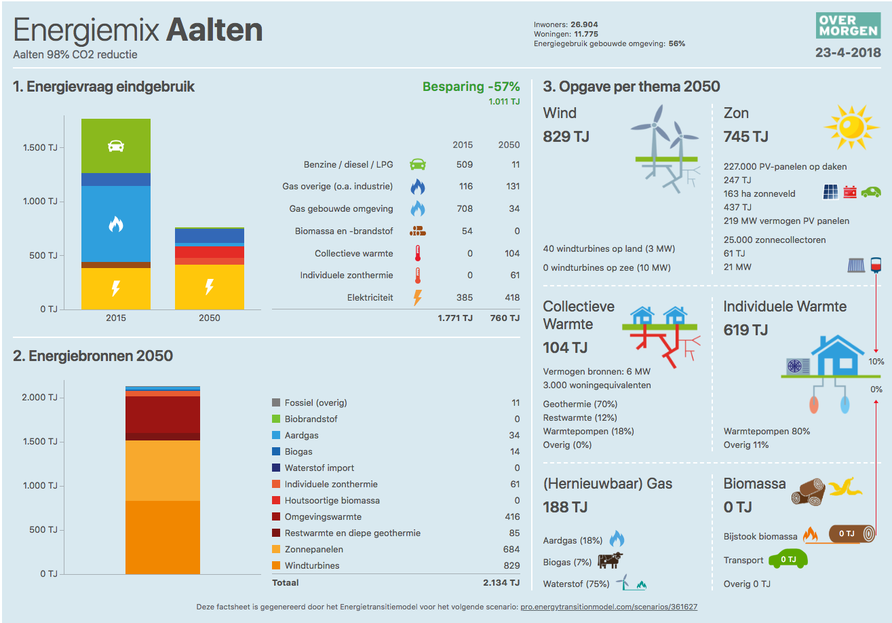

# Factsheet over energiemix

In samenwerking met het Gelders Energieakkoord en bureau Over Morgen is het Energietransitiemodel (ETM) uitgebreid met de optie om een geautomatiseerd factsheet te produceren voor je scenario.
De originele factsheet zoals ontworpen door Over Morgen is aangepast zodat deze beter aansluit op het ETM. 
Deze aansluiting is dusdanig dat ETM-uitkomsten worden gegroepeerd in categorieën die gehanteerd worden door Over Morgen.

De factsheet bevat drie hoofdonderdelen:

* Grafiek 1: Energievraag eindgebruik
* Grafiek 2: Energiebronnen
* Opgave per thema

Hieronder wordt per onderdeel beschreven welke keuzes er gemaakt zijn in de weergaven van ETM-uitkomsten en hoe de getoonde grafieken zijn opgebouwd.

## Grafiek 1: Energievraag eindgebruik

De grafiek toont het eindgebruik van energie voor het huidige jaar en het toekomstjaar. Met eindgebruik bedoelen we alle energie die een sector inkomt (energie 'aan de meter').
Deze grafiek is zo ontworpen dat alle eindgebruik van een gebied in het ETM ergens is ondergebracht.

Het ETM onderscheidt de volgende sectoren:

* Huishoudens
* Gebouwen (utiliteitsbouw)
* Industrie
* Landbouw
* Transport
* Energie (centrale elektriciteit en warmte)
* Overig

De totale afname van het energiegebruik wordt als besparing getoond (zowel absoluut als procentueel).
De volgende categorieën worden getoond:

* Benzine / diesel / LPG
* Gas overige (o.a. industrie)
* Gas gebouwde omgeving
* Biomassa en -brandstof
* Collectieve warmte
* Individuele zonthermie
* Elektriciteit

Deze categorieën zijn als volgt opgebouwd:

### Benzine / diesel / LPG

Bevat de volgende dragers:
* Benzine
* Diesel
* LPG
* Aardolie
* Kerosine
* Zware stookolie
* Steenkool
* Kolengas

### Gas overige (o.a. industrie)

Bevat de volgende dragers:
* Aardgas
* Waterstof
* LNG
* Groengas / biogas

voor de volgende sectoren:
* Industrie
* Landbouw
* Transport
* Energie (centrale elektriciteit en warmte)
* Overig

### Gas gebouwde omgeving

Bevat de volgende dragers:
* Aardgas
* Waterstof
* LNG
* Groengas / biogas

voor de volgende sectoren:
* Huishoudens
* Gebouwen (utiliteitsbouw)

### Biomassa en -brandstof

Bevat de volgende dragers:
* Houtpellets (en andere houtige biomassa)
* Bio-ethanol
* Biodiesel
* Biokerosine
* Bio-LNG

### Collectieve warmte

Bevat alle verkochte warmte. Dat is warmte die niet in de sector zelf wordt opgewekt maar via een leiding van buitenaf wordt aangevoerd. 
Ook de inzet van aardwarmte in de landbouwsector wordt hierbij opgeteld omdat deze als collectief kan worden gezien.

### Individuele zonthermie

Zonthermische warmte voor zonnecollectoren.

### Elektriciteit

Elektriciteitsgebruik. Dit kan elektriciteit zijn die lokaal wordt opgewekt met zon-PV of elektriciteit die elders wordt opgewekt.

## Grafiek 2: Energiebronnen

Deze grafiek toont een aantal energiebronnen dat in de sectie "Opgave per thema" verder wordt uitgewerkt. 

NB: Deze categorieën sluiten niet aan op de categorieën voor primair gebruik in het ETM maar hebben afwijkende definities om de nadruk te leggen op aspecten die bureau Over Morgen in haar sessies uitlicht.

De volgende categorieën worden onderscheiden:
* Fossiel (overig)
* Biobrandstof
* Aardgas
* Biogas
* Waterstof import
* Individuele zonthermie
* Houtsoortige biomassa
* Omgevingswarmte
* Restwarmte en diepe geothermie
* Zonnepanelen
* Windturbines

Deze categorieën zijn als volgt opgebouwd:
### Fossiel (overig)

Bevat alle gebruik van de volgende energiedragers:
* Aardolie
* Benzine
* Diesel
* Steenkool
* Bruinkool
* Uraniumoxide
* Niet-biogeen afval
* Kerosine
* Zware stookolie
* Overige elektriciteit*

\* Dit is de hoeveelheid elektriciteit die nog nodig is om aan de jaarvraag te voldoen na aftrek van opwek door zon en wind. Het ETM rekent op uurbasis uit hoeveel elektriciteit er nodig is naast zon en wind om het systeem in balans te houden (op de uren dat het niet waait en de zon niet schijnt moet ook aan de vraag worden voldaan). Om aan te sluiten bij het verhaal van Over Morgen is de elektriciteit benodigd voor deze balanshandhaving niet opgenomen in het factsheet. Met andere woorden: er is aangenomen dat elektriciteit van zon en wind kan worden opgeslagen en later kan worden ingezet. Mocht er dan toch te weinig totale elektriciteitsproductie van zon en wind zijn, dan wordt de extra benodigde elektriciteit in deze categorie meegenomen.

### Biobrandstof

De volgende dragers worden samengenomen in deze categorie:
* Bio-ethanol
* Biodiesel
* Biokerosine
* Bio-LNG

### Aardgas

Bevat de volgende dragers:
* Aardgas
* LNG (voor nationaal en internationaal transport)
* LPG

### Biogas

Bevat de volgende dragers:
* Groengas (opgewaardeerd en gezuiverd biogas)
* Biogas

### Waterstof import

Bevat de volgende dragers:
* Waterstof (gemaakt buiten de regio)

Lokaal geproduceerde waterstof wordt vooralsnog niet als een 'primaire' drager gerekend. Als power-to-gas wordt toegepast, wordt de primaire drager als elektriciteit gerekend (omdat deze in de regel duurzaam wordt opgewekt). Het is ook mogelijk om stoom-methaan reforming (SMR) toe te passen om zogenaamde grijze of blauwe (met CCS) waterstof te maken. In dat geval is aardgas de voornaamste primaire drager.

### Individuele zonthermie

Dit is de warmte die wordt opgewekt met zonnecollectoren in huishoudens en gebouwen.

### Houtsoortige biomassa

Bevat:
* Houtpellets
* Getorrificeerde houtpellets (die kunnen worden ingezet als bio-kolen in bijstookcentrales)

### Omgevingswarmte

Deze categorie omvat alle omgevingswarmte/-koude die door warmtepompen is gebruikt voor ruimteverwarming, koeling en warm tapwater. Dit omvat restwarmte uit de lucht en de ondiepe bodem maar geen aardwarmte/geothermie.

NB: Omdat omgevingswarmte niet als eindgebruik wordt gerekend is deze categorie een belangrijke reden dat het totaal van de grafiek "Energievraag eindgebruik" niet overeenkomt met het totaal van de grafiek "Energiebronnen".

### Restwarmte en diepe geothermie

Deze categorie bevat warmte uit:
* Geothermie (zowel voor lokale warmtenetten in de gebouwde omgeving, de landbouwsector en centrale geothermie die kan worden ingezet in het centrale warmtenet waar ook de industrie op is aangesloten)
* Restwarmte*

\* Onder restwarmte worden de volgende energiestromen gerekend: 
* Warmte uit centrale elektriciteitsproductie die wordt ingevoed op het centrale warmtenet
* Warmte uit lokale WKK-centrales in de gebouwde omgeving, landbouw en industrie.

### Zonnepanelen

Alle elektriciteit geproduceerd met zon-PV op daken en zonneweides. Ook de elektriciteit die specifiek voor waterstofproductie wordt opgewekt valt hieronder.

### Windturbines

Alle elektriciteit geproduceerd met wind op land, aan de kust en op zee. Ook de elektriciteit die specifiek voor waterstofproductie wordt opgewekt valt hieronder.

## Opgave per thema

Deze sectie van de factsheet verbindt vraag en aanbod door per thema te laten zien welke bronnen de vraag invullen en hoeveel (opgesteld) vermogen of productie-eenheden daarvoor nodig zijn.
De getallen voor de thema's tellen niet op tot de categorieën uit de linkergrafieken. De reden is dat bijvoorbeeld wind- of zonnestroom kan worden ingezet om waterstof of warmte te maken. De betreffende energie kan dus zowel bij de thema's Wind/Zon, (Herniewbaar) gas, Collectieve Warmte en Individuele Warmte worden getoond.

Hieronder wordt per thema beschreven hoe de getallen corresponderen met de uitkomsten van het Energietransitiemodel.

### Wind

Het totaal aantal Joules komt overeen met de productie van wind in de aanbodgrafiek (grafiek 2).

### Zon

Het totaal aantal Joules is de som van elektriciteit uit zon-PV en warmte uit zonnecollectoren.

Het aantal panelen op daken wordt bepaald door het aantal panelen met standaard afmeting 1.6 vierkante meter in de huishoud- en gebouwensector op te tellen en af te ronden op duizendtallen. Zonnepanelen hebben een piekvermogen van 2.72 kW in het ETM. De getallen in het factsheet zijn echter aangepast zodat ze representatief zijn voor een piekvermogen van 3.5 kW dat wordt gehanteerd door Over Morgen.

Het totale opgestelde vermogen van zonnepanelen bevat alle PV-panelen in het ETM:
* op daken bij huishoudens
* op daken bij gebouwen
* zonneweides
* zonneweides voor waterstofproductie

### Collectieve Warmte

Het totaal aantal Joules komt overeen met de post "collectieve warmte" in het eindjaar van de vraag-grafiek. Dit bevat dus alle verkochte warmte (warmte die buiten de sector zelf wordt opgewekt) plus geothermie in de landbouw. Ook WKK en ketels voor lokale warmtenetten maken hier onderdeel van uit.
Deze warmte kan zowel worden gebruikt voor ruimterverwarming als voor de bereiding van warm tapwater.

De volgende subcategorieën worden onderscheiden:
* Geothermie
* Restwarmte
* Warmtepompen
* Overig

#### Geothermie

Dit bevat geothermie in huishoudens, gebouwen, de landbouwsector en centrale geothermie die ook de industrie kan beleveren.

#### Restwarmte

In deze categorie zit warmte uit:
* WKK voor belevering van lokale warmtenetten
* WKK voor industrie en landbouw
* elektriciteitscentrales

#### Warmtepompen

Deze categorie bevat alle warmte geleverd door collectieve warmtepompen. 

#### Overig

In deze categorie wordt collectieve warmte uit de volgende technologieën samengenomen:
* Waterstofketel voor lokale warmtenetten in huishoudens en gebouwen
* Gasketel voor lokale warmtenetten in huishoudens en gebouwen
* Centrale kolenketel
* Centrale bruinkoolketel
* Centrale olieketel
* Centrale gasketel
* Centrale afvalverbrandingsketel
* Centrale gasgestookte back-upketel

### Individuele Warmte

Warmte kan worden gebruikt voor ruimteverwarming en voor warm tapwater.

In deze sectie worden de volgende energiestromen opgeteld:
* Warmte/koude uit individuele warmtepompen
* Warmte uit zonnecollectoren
* Warmte uit individuele houtpelletkachels
* Overige individuele warmte/koude*

\* De "overige" categorie bevat de volgende energiestromen:
* Warmte en koude van elektrische technologieën anders dan warmtepompen
* Warmte van individuele gasketels
* Warmte van individuele kolenketels
* Warmte van individuele bruinkoolketels
* Warmte van individuele olieketels
* Warmte van individuele kolengasketels

Deze ketels en technologieën kunnen in de huishoudens, gebouwen, landbouw en industrie staan.

### (Hernieuwbaar) Gas

Het totaal aantal Joules is de optelling van de volgende energiestromen:

* Groengas dat wordt ingemengd in het gasnet
* Biogas dat wordt gebruikt door WKK
* De totale hoeveelheid gebruikte waterstof (geëxporteerde waterstof wordt niet meegeteld)
* Aardgas (inclusief LPG en LNG)

### Biomassa

Het totaal aantal Joules is de optelling van de volgende energiestromen:
* Houtige biomassa (houtpellets) voor individuele ruimteverwarming in de gebouwde omgeving
* Biobrandstoffen voor vervoer (bio-ethanol, biodiesel en bio-LNG)
* Overige biomassa*

\* Deze categorie bevat de volgende energiestromen:

* Houtige biomassa voor WKK in de landbouw
* Houtige biomassa voor collectieve WKK in gebouwen (utiliteitsbouw)
* Overig biomassagebruik in gebouwen (niet verder gedefinieerd op de energiebalans)
* Houtige biomassa in centrale (ultra superkritische) bijstook WKK-centrales
* Houtige biomassa in centrale (ultra superkritische) bijstook elektriciteitscentrales
* Houtige biomassa in centrale biomassaketel
* Houtige biomassa voor koken in huishoudens
* Houtige biomassa voor warm tapwater in huishoudens
* Houtige biomassa in industrie
* Houtige biomassa in de "overige" sector
