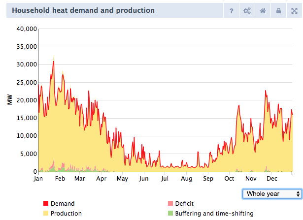

## What does Fever exactly do? Here the steps:

1.	First, it generates one normalised heat demand profile for all households based on the division old and new houses and the average insulation of old and new houses.
2.	Then, this heat demand profile is multiplied by the total heat demand going to each heating technology (the user sets the share in the front-end), which gives a specific heat demand profile for each technology (with the capacities that are needed each hour per year).
3.	Then, it compares the total available capacity per technology (input capacity * number of units) with the capacities that are needed per hour to fill the heat demand. 
4.	When the available capacity of a certain technology cannot produce the heat capacity that is needed, then fever registers a heat deficit. NOTE: this deficit does not change the produced energy of that technology; the technology still produces enough heat (on a yearly basis)! The deficit is shown in a chart in the front-end: Household heat demand and production.
(BTW: the full load hours are not adjusted by Fever, they are depended on the total heat demand for households. Each technology has the same heat output in PJ per year (full load hour * capacity per unit) )

