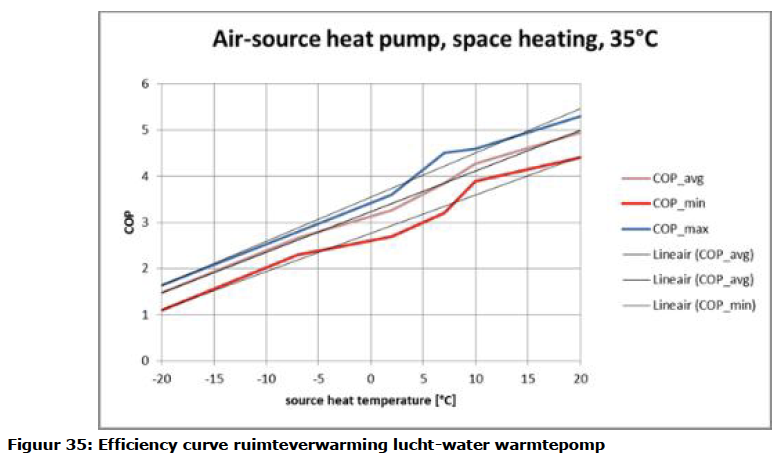
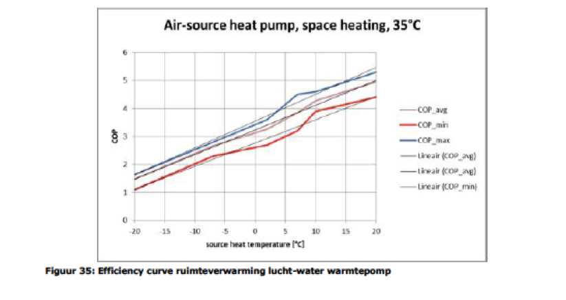
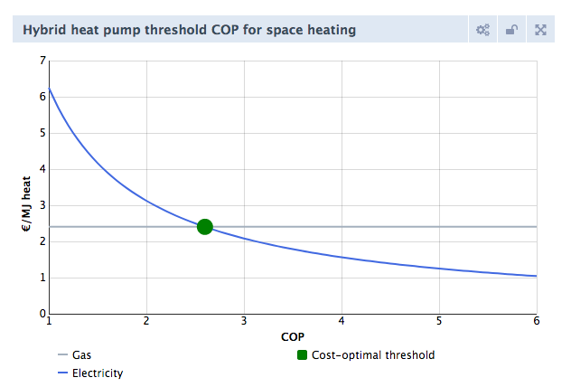
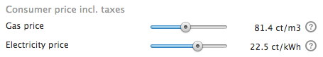
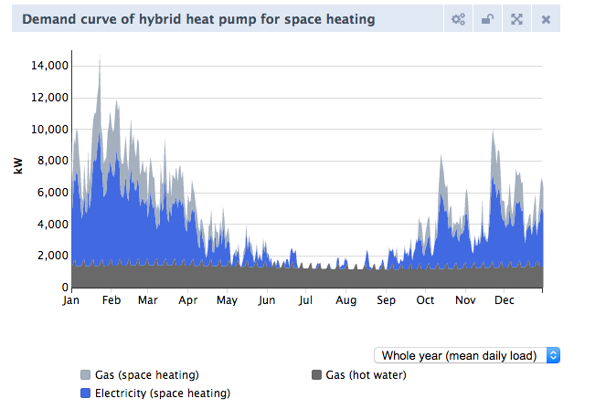

# Heat pumps

In 2017 improvements to the way heat pumps are modelled in the ETM have been implemented. These improvements include temperature dependency of the COP of heat pumps air and hybrid heat pumps and the addition of buffers for hot water and space heating. For hybrid heat pumps (HHP) the user can use sliders that determine when the HHP switches to gas or hydrogen. 

## Temperature dependency of COP
Heat pumps extract heat from air (HHP and heat pump air) or water (heat pump ground). The coefficient of performance (COP) is influenced by the temperature of the source from which heat is extracted. 

### Space heating - Heat pump air

**Space heating**

The temperature dependency of the COP of heat pumps air is based on research done by ECN and used by Ecofys in their report "Systeemkosten van warmte voor woningen" (<a href="#ref">Ecofys, 2015</a>).

The equation used is:

`  COP(T) = 3.25 + 0.0875 T     		(1)`

Where T is the ambient temperature.

**Hot water**

The temperature dependency of the COP of heat pumps air is also based on research done by ECN and used by Ecofys in their report "Systeemkosten van warmte voor woningen" (<a href="#ref">Ecofys, 2015</a>).

The equation used is:

`  COP(T) = 1.86 + 0.043 T     		(2)`

Where T is the ambient temperature.

More information about the sources behind specifications of heat pump ground can be found here: [Documentation heat pump air - space heating](https://github.com/quintel/etdataset/blob/master/nodes_source_analyses/households/households_space_heater_heatpump_air_water_electricity.converter.xlsx) and here: [Documentation heat pump air - hot water](https://github.com/quintel/etdataset/blob/master/nodes_source_analyses/households/households_water_heater_heatpump_air_water_electricity.converter.xlsx).

### Space heating - Hybrid heat pumps
For temperature dependency of COP of HHP's the same parameters are used as for heat pump air.

More information about the sources behind specifications of hybrid heat pumps (on gas) ground can be found here: [Documentation hybrid heat pump (gas) - space heating](https://github.com/quintel/etdataset/blob/master/nodes_source_analyses/households/households_space_heater_hybrid_heatpump_air_water_electricity.converter.xlsx), and here: [Documentation hybrid hydrogen heat pump (gas) - hot water](https://github.com/quintel/etdataset/blob/master/nodes_source_analyses/households/households_water_heater_hybrid_heatpump_air_water_electricity.converter.xlsx)

More information about the sources behind specifications of hybrid heat pumps (on hydrogen) ground can be found here: [Documentation hybrid heat pump (hydrogen) - space heating](https://github.com/quintel/etdataset/blob/master/nodes_source_analyses/households/households_space_heater_hybrid_hydrogen_heatpump_air_water_electricity.converter.xlsx), and here: [Documentation hybrid hydrogen heat pump (hydrogen) - hot water](https://github.com/quintel/etdataset/blob/master/nodes_source_analyses/households/households_water_heater_hybrid_hydrogen_heatpump_air_water_electricity.converter.xlsx)

**Threshold-COP**

The efficiency of hybrid heat pumps (HHP) is dependent on the ambient temperature and is depicted by the coefficient of performance (COP). The COP becomes lower as the outside temperature decreases. In the ETM it is possible to set the COP for which the HHP must switch between electricity and gas. You can choose a setting that is most financially attractive for the consumer, but you can also choose a setting that produces less impact on the electricity network 

To help you decide the cost-optimal COP setting from a consumer perspective, a special chart is added to the ETM. It shows how much it costs to make a unit of heat with the HHP for space heating. For the gas part, these costs are independent of the COP (and therefore the outside temperature). The costs for the electrical part are decreasing with increasing COP (and increasing outside temperature). The intersection of the two curves is the cost-optimal COP setting for space heating for the given cost price gas and electricity. This assumed cost price of gas and electricity can be set with sliders. 

The assumptions below:

- Gas price 81.4 ct/m3 gas
- Electricity price 22.5 ct/kWh
- Gas efficiency space heating = 1.07

lead to a cut off COP for space heating of **2.6**. This cut-off COP is used in the start situation of your scenario. For the HHP on hydrogen we adopted the same cut-off COP.

When you're interested in the impact of HHPs on the electricity grid, you can have a look at the chart that is shown when clicking on the 'Annual'-button in the right corner of the chart. This chart shows the hourly gas and electricity demand of HHPs. 

### Space heating - Heat pump ground
The COP of heat pump ground is independent of the ambient temperature. The temperature of the reservoir in the ground from which the heat pump extracts heat is considered constant.

More information about the sources behind specifications of heat pump ground can be found here: [Documentation heat pump ground - space heating](https://github.com/quintel/etdataset/blob/master/nodes_source_analyses/households/households_space_heater_heatpump_ground_water_electricity.converter.xlsx)

## Buffers
In the ETM all heat pumps have the option to install buffer for space heating and a buffer for hot water. 

The default settings of these buffers represent a common setup of heat pumps in households. However, in the future these buffers might also be used to store larger amounts of heat. 

### Heat pump air and heat pump ground
Currently most heat pumps (air) are installed without a buffer for space heating. Most heat pumps (air) require a buffer to prevent unnecessarily frequent on and off switching of the compressors. In the default settings of the ETM the buffer for hot water takes care of this.

In the current situation the hot water buffer represents a tank of 100 liter (which is typical for a Dutch household) and has a storage capacity of 5 kWh.

In the future buffers can also be used to store larger amounts of heat.

### Hybrid heat pump
Most hybrid heat pumps are self-regulating. They don't need a buffer to protect the compressor.

With the default settings the hybrid heat pump supplies hot water with either gas or hydrogen. In that case a buffer for hot water is not needed.
By lowering the threshold COP the electric part of the hybrid heat pump can also supply hot water. In that case it is advised to install a buffer for hot water (typically 5 kWh).

## References
- Ecofys, 2015: [Systeemkosten van warmte voor woningen](https://refman.energytransitionmodel.com/publications/2063)

