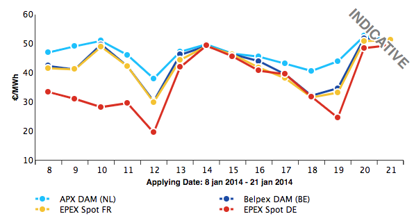
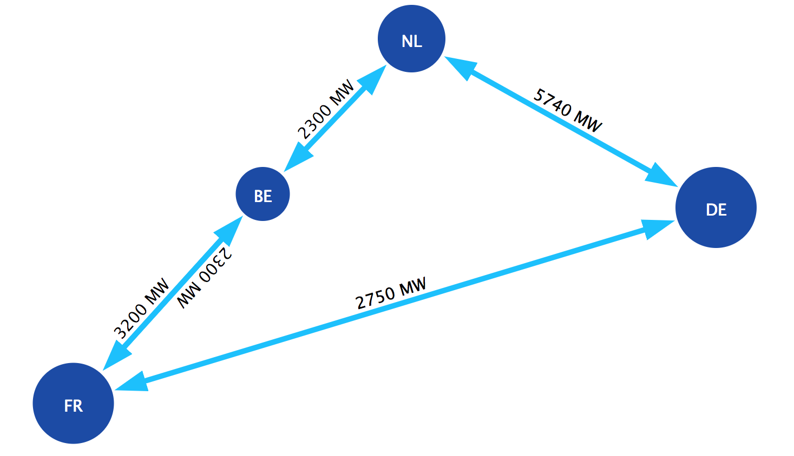
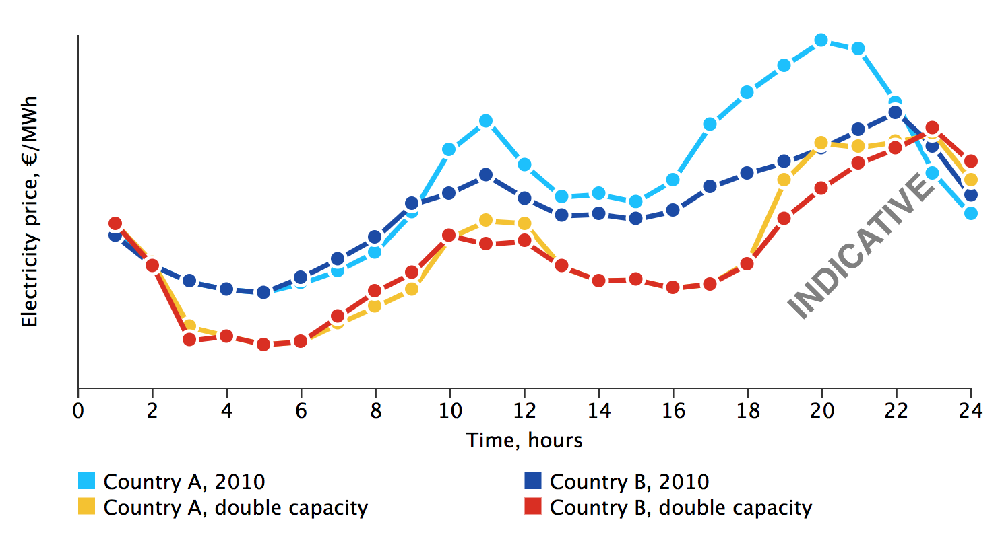
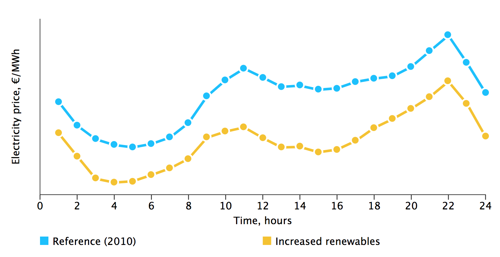

# Import and export of electricity

## Integration of the electricity markets

The electricity market is one of the last markets in the EU facing cross-border integration. Most industries are already competing in the EU Single Market. The proposal of the European Commission to create a common European energy policy was an important step towards harmonising national markets into working regional markets and finally a pan-European market.

In order to achieve this, both physical interconnection capacity and administrative market coupling are being realized. The thinking is that markets are the most efficient means to assure demand is met by supply at the lowest costs. Overall expected benefits are: 

* Lower electricity costs 
* More equal electricity prices between countries

In practice, market distortions by (the mismatch of) individual member states' policies may result in less than perfect market coupling.

## Towards a European 'Merit Order'

The so-called merit order (also see Merit Order) determines the order in which producers of electricity meet demand. Producers with the lowest marginal costs have priority. 

This means that, in general, countries with cheaper electricity production will export to countries with more expensive production. They will do this until prices in both countries converge or the interconnectors work at maximum capacity. 

In order to achieve the coupling of electricity markets on a physical level, interconnections between countries are being increased and their utilization optimized.

## Effects of increasing interconnector capacity

Countries in the EU are planning to invest in increasing interconnection capacity (see [10-Year Network Development Plan (ENTSO-E)](https://refman.energytransitionmodel.com/publications/1829)). In the chart below, we qualitatively show how the electricity prices of two countries change if the interconnection capacity between them is doubled. 

The blue lines show the hourly electricity prices for countries A and B in the reference year (2010). When the blue lines meet (e.g. hours 1-5) the price of electricity is the same for the two countries (convergence). This happens because they both use electricity from the cheapest producer available (electricity is being exported from the country with cheapest production to the other country). 

At all other times the blue lines do not match. This happens because, even if one of the countries has cheap production capacity available, the interconnector is already working at maximum capacity (is congested). The country that cannot import the cheap electricity will have to get it from a more expensive local producer. 

The red lines show the prices of electricity when the interconnection capacity is doubled. Because the capacity is higher, the interconnector is congested less often and the price of electricity converges more frequently.

## Effects of additional renewable generation

The EU has the goal to increase the available capacity of renewable energy sources (RES) for 2020 (see [Scenario Outlook and System Adequacy Forecast 2011-2025 (ENTSO-E)](https://refman.energytransitionmodel.com/publications/1830)). The future situation that we consider here features installed capacities of wind and solar up to 2020 targets. 

In the chart on the below, we can (qualitatively) see what the effect on the marginal electricity production costs would be compared to the present situation. 

The blue line shows the hourly costs of producing electricity in the present and the orange line when increasing the capacity of RES. The decrease in the costs results from the larger share of RES capacity, which has zero marginal electricity production costs (see Merit Order). The average costs of producing electricity are therefore lower. 

Note that the costs for investments and installation of renewable generating capacity have not been included here. These are typically much higher than for non-renewable capacity. The integral production costs are therefore likely to increase with more renewable capacity.
