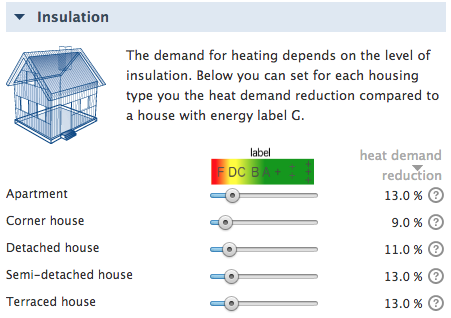
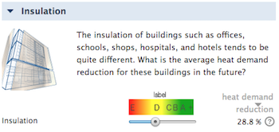
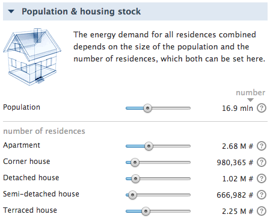
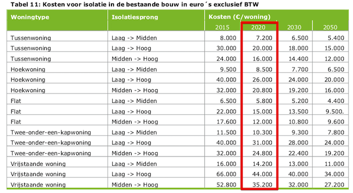
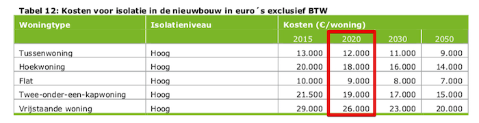

Introduction
------------

Insulation can be used to bring down the amount of heating we need for our houses to stay comfortable. The ETM allows you to choose insulation levels for each housing type and for all buildings (in the Commercial and Public Services, shortly CaPS, sector) separately. This page discusses the modeling methods used for the implementation of insulation in the ETM and the data that underlies the modeling.

Housing types
--------

We have distinguished between five housing types for modelling heat demand in households: apartments, corner houses, detached houses, semi-detached houses and terraced houses. These housing types are recognisable in the Netherlands and used in the [Basisregistratie Adressen en Gebouwen (BAG)](https://bagviewer.kadaster.nl/lvbag/bag-viewer/index.html#?geometry.x=160000&geometry.y=455000&zoomlevel=0), which contains all official data of all households and buildings in the Netherlands. 

Heat demand reduction
--------

There are five insulation sliders for each housing type and there is one insulation slider for all buildings in general. The insulation sliders set the heat demand reduction, which is the fraction of heat demand that is saved through insulation. We derive the heat demand reduction from the Energie-Index (EI) of the houses and buildings within a region, which is retrieved from BAG-data for the Netherlands. However, the mapping between heat demand reduction and the EI is ambigious, because the EI does not only depend on the insulation level. Instead it is based on 150 different factors (source: [RVO](https://www.rvo.nl/onderwerpen/duurzaam-ondernemen/gebouwen/wetten-en-regels-gebouwen/bestaande-bouw/energie-index)), including the presence of solar panels or the type of heating technology installed, which both do not influence the heat demand of a building. Additionally, the EI is not defnitive for many houses yet.

Despite the above reasoning, we chose to use the EI, because there is no other data available. It still gives a reasonable insight in the average insulation level of a region. This is the mapping that we used to translate the the EI into a heat demand reduction for each housing type relative to a label G house: 

| Energy label |	Energie-Index | Detached | Corner| Terraced | Semi-detached | Apartement | 
| ---- | ----|---- |---- | --- |---|--- |
| G	| > 2.7 |	0% | 	0% |	0% |	0% |	0% |
| F |	2.41 - 2.7 |	4% | 	3% |	3% |	4% | 3% |
| E |	2.11 - 2.40 |	7% | 	5% |	5% |	9% | 5% |
| D	 | 1.81 - 2.1 |	11% | 	13% |	13% |	13% | 8% |
| C |	1.41 - 1.8 | 17% |	 21% |	21% |	18% | 17% |
| B |	1.21 - 1.4 | 24% |	 29%  |	29% |29% | 27% |
| A |	0.81 - 1.2 | 37% |  35% |	37% |	40% | 32% |
| A+ |	0.61 - 0.8 | 50% |	42% |	46% |	50% | 38% |
| A++ | 0.41 - 0.6 | 59% | 55% |	57% |	60% | 52% |
| A+++ |	< 0.4 | 67% |  69% | 69% |	69% | 67% |

For utility buildings we calculated the heat demand reduction relative to a label E building:

| Energy label | Energie-Index | Buildings | 
| ------ | ------ | ------ |
| E |	2.11 - 2.40 | 0% |
| D	 | 1.81 - 2.1 | 31% |
| C |	1.41 - 1.8 | 46% |
| B |	1.21 - 1.4 | 54% | 
| A | 0.81 - 1.2 | 64% | 
| A+ |	0.61 - 0.8 | 74% | 

The above tables show a rough estimate of the relationship between energy labels, EI and heat demand reduction. The mapping is based on the following data:

- The heat demand per energy label is based on data of the energy model Vesta developed by PBL Netherlands Environmental Assessment Agency ([link to website](https://www.pbl.nl/vesta)). For labels that are not specified in the data, the heat demand is interpolated. These are the links to the datasets: 
	- [Vesta Woningen BAG (2016)](https://github.com/RuudvandenWijngaart/VestaDV/blob/master/data/20160707_Woningen_BAG.csv)
	- [Vesta Woningen Nieuwbouw BAG (2016)](https://github.com/RuudvandenWijngaart/VestaDV/blob/master/data/20160525_Woningen_Nieuwbouw_BAG.csv)
	- [Vesta Utiliteiten BAG (2016)](https://github.com/RuudvandenWijngaart/VestaDV/blob/master/data/20160706_Utiliteiten_BAG.csv)
	- [Vesta Utiliteiten Nieuwbouw BAG (2016)](https://github.com/RuudvandenWijngaart/VestaDV/blob/master/data/20160525_Utiliteiten_Nieuwbouw_BAG.csv)
- The maximum heat demand reduction for label A+++ house is retrieved from the Ecofys report ['De systeemkosten van warmte voor woningen (2015)'](https://refman.energytransitionmodel.com/publications/2063)

NOTE: the label image above the household insulation sliders shows the *average* label vs. heat demand reduction mapping for all housing types. 

Insulation costs
--------

In the ETM costs are calculated based on the 'greenfield approach', which means that no costs are calculated for the current situation and costs are only added when changes occur. So insulation costs are only taken into account when houses are more insulated. (NOTE: when the user reduces insulation, then nothing happens: neither to the costs or to the heat demand. We consider reducing insulation as not realistic)

### Households

The insulation costs for houses are based on the Ecofys report ['De systeemkosten van warmte voor woningen (2015)'](https://refman.energytransitionmodel.com/publications/2063), where the investment costs for different 'insulation jumps' (low -> medium insulation, low -> high insulation, medium -> high insulation) are specified. We have chosen to use the 2020 insulation costs. The table below shows the insulation costs for existing houses.

When the number of houses increases for a certain housing type, then the newly built insulation costs are taken into account for these newly built houses. If the insulation level of that housing type is not set on "high" insulation, we use interpolated insulation costs. The insulation costs in the table below only include the materials used. 

Low, medium and high insulation in the report is roughly specified as:

To link the insulation costs to specific heat demand reductions we used [ECN heat demand profiles](https://github.com/quintel/modeling_experiments/blob/master/heat_demand_profiles/input_data/Ecofys_ECN_heating_profiles.csv) that have been used for the Ecofys study. We summed the total heat demand for each insulation level and each housing type and then calculated the heat demand reduction. The calculation resulted in the following mapping between low/medium/high insulation and heat demand reduction:

| Housing type | Low | Medium | High | 
| ------ | ------ | ------ |-----|
| Apartment | 0% | 32% | 67% |
| Corner house | 0% | 23% | 69% |
| Detached house | 0%| 23% | 67% |
| Semi-detached house | 0% | 26% | 69% |
| Terraced house | 0% | 31% | 69% | 

The insulation sliders are continuous and not limited to only three choices (low / medium / high). Therefore, the insulation costs have been interpolated; the resulting .csv-files can be found [here](https://github.com/quintel/etsource/tree/master/datasets/nl/real_estate). 

NOTE: The insulation costs for households are depended on the level of insulation in the present year: f.e. going from low to medium insulation is cheaper than from medium to high insulation. 

### Buildings

The insulation costs for buildings could not be retrieved from the Ecofys study, instead the costs originate from the BAG-data used in the Vesta energy model ([Vesta Utiliteiten BAG (2016)](https://github.com/RuudvandenWijngaart/VestaDV/blob/master/data/20160706_Utiliteiten_BAG.csv) & [Vesta Utiliteiten Nieuwbouw BAG (2016)](https://github.com/RuudvandenWijngaart/VestaDV/blob/master/data/20160525_Utiliteiten_Nieuwbouw_BAG.csv)):

- In these datasets the insulations costs are given for each insulation jump and each type of utility building. Since the ETM only models an average utility building, a weighted average has been of the insulation costs. We did this based on the Dutch distribution of floor area between the different utility building types ([ECN](https://www.rijksoverheid.nl/documenten/rapporten/2017/11/01/rapport-verkenning-utiliteitsbouw)). 
- The datasets report minimum and maximum insulation costs, based on taking the insulation measures on a natural vs. unnatural/independent moment. For new buildings we have assumed the minimum insulation costs and for existing buildings we have taken the average of the minimum and maximum costs.

The above modifications result in the following insulation costs for an average utility building:

| Type | Insulation costs [€ / % heat demand reduction] | 
| ------ | ------ | 
| Existing utility building |	€ 605.99 | 
| New utility buidling	 | € 478.55|

Heat demand profiles
--------

The ETM models heating in buildings and households on an hourly basis through [Fever](https://github.com/quintel/documentation/blob/master/general/fever.md).

[To be continued.....]

