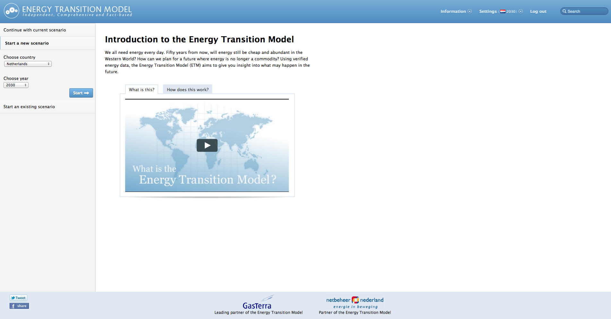
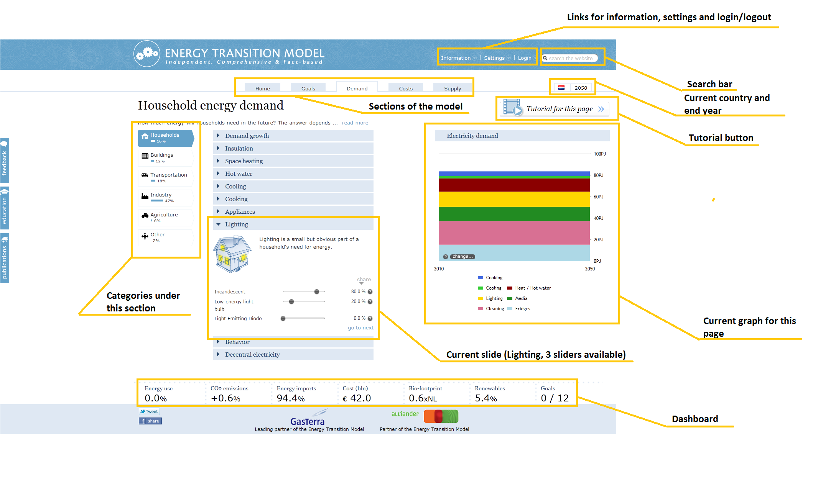

# Interface

The ETM interface consists of several important sections, which will be explained below.

The start screen
----------------

In the start screen a user can select to start with a new scenario, load an existing demo scenario. If the user was already working on a scenario immediately before navigating to the start screen, he can also continue with this scenario by clicking "Continue with current scenario".

If the user selects "Start a new scenario" he can choose the country that he wants to model, the end year of the model and the difficulty level of the interface. The difficulty level determines how many sliders are visible in the model.

In the top right of the screen the user can also login to his/her account, or create one. There are additional links to information about Quintel, our partners and our education program.

The main interface
------------------

The main interface contains a structure that the user should know in order to navigate the model effectively.

The tabs in at the top of the screen contain the main topics of the ETM:

1.  [Targets](targets.md)
2.  [Demand](demand.md)
3.  [Costs](costs.md)
4.  [Supply](supply.md)

Clicking one of these categories opens the relevant section of the ETM. On the left side of the screen all the sub-topics are shown. The sub-topics are again divided into sub-sub-topics called 'slides'. Sliders are organized by slde. By clicking on a slide a user opens the overview of sliders relevant for this slide. Additionally, a chart is loaded that will show the effect of a slider when a user touches it.

The results of touching a slider are further shown in the dashboard at the bottom of the screen. Every time a user touches a slider the values in the dashboard are updated and arrows show the direction of the change.

A user can change the settings for the scenario under settings in the top right corner. The user can also save, load and reset his scenario and change the language of the interface here. In order to save or load a scenario a user has to create an account.

On pages that have a tutorial available there is a button that can be clicked by the user. This will open a separate window with video tutorials.

In the top right the user can see the end year of the model and the flag of the area that he is creating a scenario for.

Energy mixer
------------

The Energy mixer presents a simplified interface that allows a user to fill in the model by answering a series of questions. The Energy mixer is currently only available for the Netherlands, but can be adapted for any country.

The Energy Mixer can be found at <http://mixer.et-model.com/>
