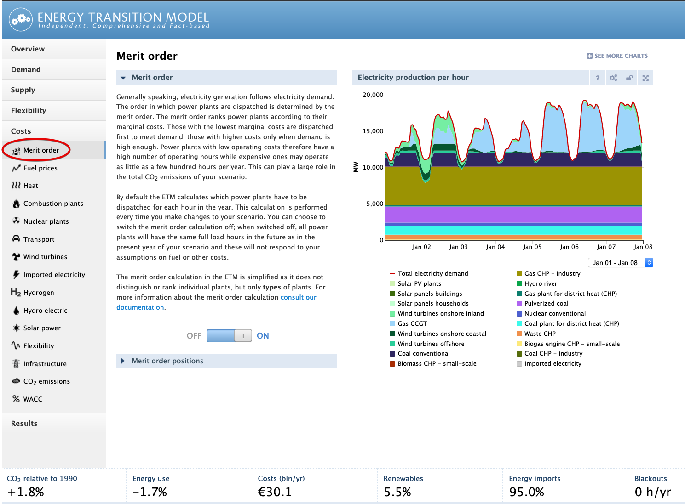
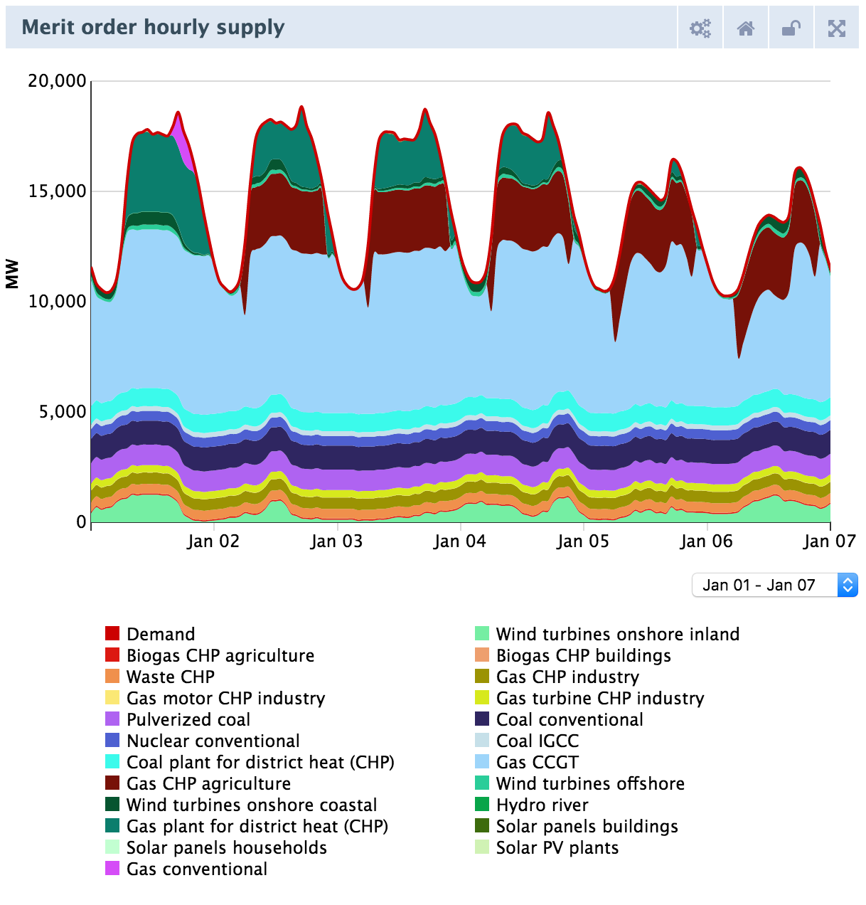
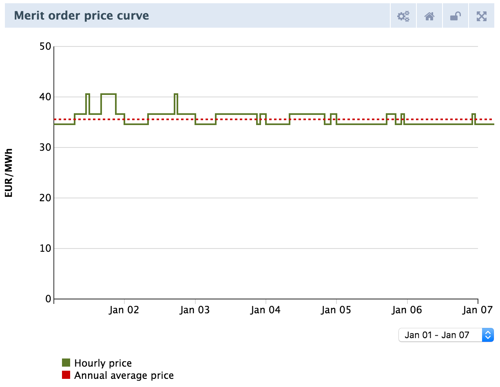
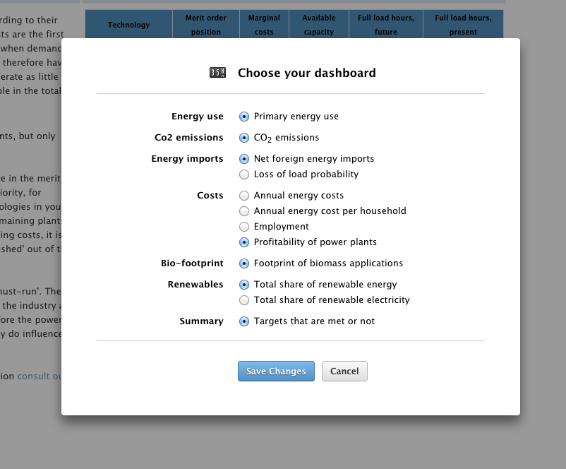
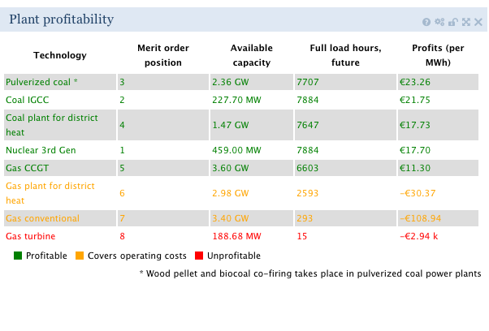
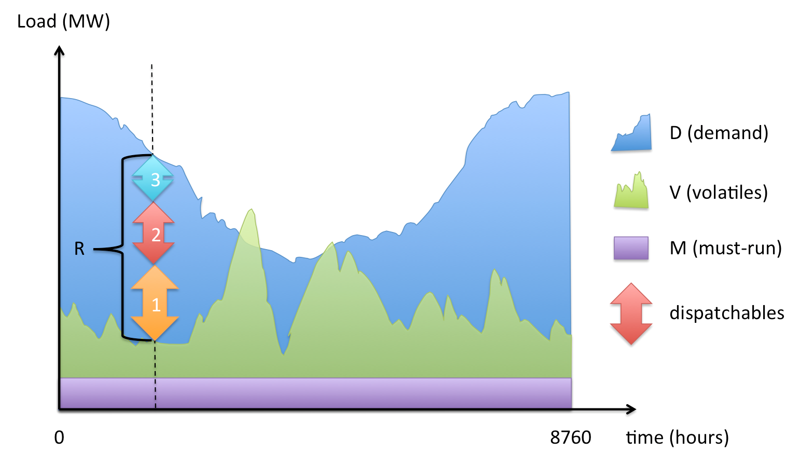
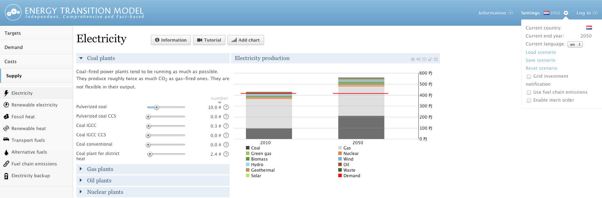

# Merit Order

For Dutch readers: Het oorspronkelijke project is uitgevoerd met subsidie van het Ministerie van Economische Zaken, voor het TKI Gas uitgevoerd door Agentschap NL. Translation: The original project was supported by subsidies from the Ministry of economic affairs.

This page serves to explain the merit order implementation in the ETM in cooperation with Energie Nederland in Q4 2012 and the subsequent update in 2016. The Merit Order Module is available in the professional version of the ETM in
the Cost \> Merit Order slide as shown in Figure 1.



Introduction
------------

The merit order module calculates the hourly electricity mix based on the demand for electricity and the installed capacities and marginal costs of the electricity producing technologies (called producers from now on). The two main results of this calculation are the full load hours for these producers and the amount of excess electricity that is used by the different flexibility technologies.

As of 2016, the merit order calculation is switched on by default. The user can switch the merit order calculation off. In that case the ETM does not match electricity generation and demand. When producers (gas plants, coal plants, wind turbines etc.) are built, the model assumes that these producers are operating regardless of the actual need for electricity. If the production exceeds the annual demand for electricity, the surplus is exported. Similarly, electricity scarcity will be balanced with importing electricity.

With the merit order switched on, the merit order module manages power plants in a smarter way. Power plants are turned on and off in order to follow the electricity demand, which actually varies over the course of time. Instead of having a plant running just because it exists, the merit order will only allow a plant to operate when its output is required (this is under the presumption that the power plant is [dispatchable](#producers) and can be turned off). At times of low demand, only those producers are turned on that generate electricity at lowest costs. If the demand increases from one hour to the next, additional (and more expensive) producers are switched on. Based on this mechanism, the amount of time is calculated that each power plant actually needs to run in order to fulfill the electricity demand. In other words, the merit order calculates the full load hours of each participant.

The term 'merit order' refers to the order in which dispatchable plants are used to fill up the demand for electricity. This order is based on the marginal costs (in units of 'euro per MWh of produced electricity') of these plants, which are essentially the costs of producing an extra unit of electricity.

It is important to note that turning on the merit order module will take control over how electricity is generated in the ETM. You will find that the merit order turns off all the expensive power plants when they are not needed (for example because you installed too many, [see example below](#installing_too_many_power_plants)).

Some electricity producers, like wind turbines, cannot be turned off at will as their production is determined by outside factors, like wind in this case. This also holds for must-run producers, such as biogas CHPs. For scenario's with large capacities of these volatile and must-run producers, their total electricity production might exceed the electricity demand. To make most use of this excess electricity, the user can include flexibility options in their scenario. These flexibility options are described in a [dedicated section](flexibility.md).

The full load hours and the use of the various flexibility options (outputs of the the merit order module) are used in the ETM for the scenario in the 'future' year, impacting, among others, CO2 emissions, costs, import&export, total energy use and renewable percentages of electricity and energy. In addition, the module calculates financial metrics for producers such as **profit** and **profitability** ([defined below](#profitability)).

Displaying outputs of the Merit Order Module
--------------------------------------------

#### Switching the module on and off

The module can be switched on and off using the switch on the Merit Order slide or by using the checkbox in settings menu, see Figure 1. As of 2016, the merit order is switched on by default.

#### The Merit Order table and chart

There are five dedicated output elements associated with the Merit Order module: two tables and three charts. The first two charts provide insight in the result of the merit order calculation by showing the hourly electricity mix and the hourly electricity price.





In Figure 4, the table and chart that show information about full load hours and marginal costs. The table associated with profitability is shown in Figure 5 and will be discussed in the next sub-section.

 and Merit Order graph (right).")

The table shown in Figure 4 lists all electricity producers in the ETM. There are two classes of producers distinguished in the context of the Merit Order, the producers whose full load hours are *independent* of the outcome of the Merit Order calculation. This class includes **volatile** producers of electricity such as solar panels and wind turbines which produce electricity *irrespective* of the demand and **must-run** producers. The second class is made up of **dispatchable** producers and includes nuclear, coal and gas plants. In contrast to the volatiles, the plants have the capability to react to variations in demand. For the producers, the following properties are displayed in the *Merit Order Table*:

-   Position in the Merit Order: The position in the merit order is simply the order based on the marginal cost.
-   Marginal costs: The costs concerned with producing an extra unit of electricity.
-   Available capacity: The available capacity is equal to the installed capacity of a producer multiplied by its **availability**.
-   Availability is a factor that describes how much of the year this producer can run. For example, the (3rd generation) nuclear power plant in the ETM has an availability of 0.9 which means it can run for 0.9 \* 8760 = 7884 hours per year.
-   Full load hours future: The full load hours of the 'future' year are being calculated by the Merit Order module.
-   Full load hours present: The full load hours of the 'present' are fixed to the values of the start year of the scenario.

Note that some technologies are grouped in this table: solar panels, wind turbines and must-run CHPs. Their full load hours are a weighted average, where the installed capacity is used as weight.

The *Merit Order Chart* (Figure 4, right side) shows the installed capacity of electricity producers, sorted in ascending order of their class (volatiles and must-run first, then dispatchables) and marginal costs (lower cost first). This chart is dynamic and reacts to changes made to the model. In particular, fuel prices and installed number of units of the producers in the merit order. Increasing the coal price, for example, can interchange the (merit!) order of coal and gas-plants in the chart.

### Using the dashboard item: Profitability

 

You can click on the 'change' button in the dashboard (see Figure 1, lower- right corner) to choose the profitability dashboard item. This will show the percentage of profitable power plants. More detailed information about profitability of electricity producers can be obtained by clicking the dashboard item which will open the table shown in Figure 6. We define three categories of profitability:

1.  Profitable
2.  Conditionally profitable
3.  Unprofitable

See also :[Profitability](#profitability).Note that the Merit Order module does not take individual plants into account, but rather **plant-types** as producers. This simplification may be alleviated in a follow-up project. As a result of this simplification, the profitable percentage can make large jumps if a producer with a large installed capacity passes the threshold from conditionally profitable to unprofitable.

Implementation
--------------



The Merit Order module orders the dispatchable producers according their **marginal costs** and computes their yearly production of electricity (and, equivalently, their full load hours). Additionally, the module sets a price for electricity for every hour of the year.

To accomplish this, the module matches the production of electricity to the demand for every hour of the year. This time-resolved approach is radically different from what is done in the rest of the ETM (only yearly values are calculated). To accommodate these two different approaches, the MO calculation is performed in a separate module and the results (chiefly new full load hours, and profitability metrics) are returned to the ETM in their 'yearly' total form. We will describe the workings of the module in more detail in this section.

#### Participants

Both **users** and **producers** of electricity are called **participants** of the Merit Order.

##### Users

All devices that consume electricity are **users**. Currently, this is the total demand for the Netherlands (which represents the sum of all electricity demands). The total demand curve is currently the sum of all electricity consumption of the Netherlands **plus** losses in the electricity network and all power plant"s own electricity consumption. The ETM provides the Merit Order Module with the total annual electricity demand (currently about 420 Petajoule) and a pattern that represents a distribution curve. From this, the Merit Order Module derives the total electricity demand for each hour of the year.

In Figure 6, a cartoon of a demand profile is shown in blue. It has 8760 datapoints (units of MW), one for every hour of the year.

##### <a name="producers"></a>Producers

A producer is an electricity producing technology, such as a nuclear power plant or wind turbine.

The Merit Order Module considers three types of producers:

-   Volatile (e.g. wind turbine, solar panel)
-   Must-Run (e.g. biogas CHPs)
-   Dispatchable (e.g. coal or gas power plant)

These three producers each play a different role in the Merit Order Module.

### Merit Order Algorithm

For every hour, the Merit Order Module examines the electricity demand and production independently. The following steps are carried out:

#### Residual Demand Curve

First, all producers that are labelled **Volatile** or **Must-Run** are taken into account. As these plants cannot (or should not) be turned off; their electricity output has to be fed into the grid with priority. (Another reason for giving volatile renewable producers priority is that they generate electricity at zero marginal cost.) By subtracting the electricity produced by Volatiles and Must-Run producers from the electricity demand, the **residual demand** curve is obtained.

This can also be seen in Figure 6.: The violet and green curves are used to satisfy demand first. Most of the time, the total electricity demand is not satisfied yet. The residual demand (= demand - volatiles - MustRun, equivalent to blue area) is labelled with the letter R. in the figure. Note: The residual demand curve may fluctuate a lot, depending on your choices for installed volatile and must-run participants. You can see in the graph, that there is one occasion where the production from must-run and volatile participants exceed the demand (the green peak sticking out of the blue area).

##### Current Load Profiles

The volatiles and must-runs have a-priori defined curves that determine their 'on-time'. The following profiles are used to determine the hourly production by scaling them with the installed capacity of the respective participant.

-   solar pv panels
-   offshore wind turbines
-   coastal wind turbines
-   inland wind turbines
-   hydro river
-   biogas CHPs (flat curve)

Dispatchables do not have a load profile defined yet, because their time-resolved production will be calculated by the MO module.

'''NOTE: The scaling of MO load\_profiles can result in loads (MW) larger then '''the available efficiency This happens because the area under the profiles needs to be scaled to the total produced electricity but the shape of the profiles does not always include all information.

For example, the profiles for wind may not describe every gush of wind that has been converted into electricity and therefore 'misses' features, i.e., it has a trough where it should have a peak. This is inevitable as we do not have measurement of every location in the Netherlands where a turbine is situated and we do not know the exact relation between the wind speeds (measured) and the production of a turbine. This means that to reproduce the total production, the profile has to be scaled vertically (to make up for the lost peaks) and peaks in the load may become unphysically high. This is not a fundamental problem, as the curve is only indicative of the variability of the technology, but it might confuse the user.

#### Satisfying Residual Demand, Assigning Dispatchables

Secondly, the module tests how much additional producers are needed to satisfy the residual demand. The module starts with the cheapest plant first (lowest marginal operation costs). In Figure 6., this would be the yellow arrow (1). As the production capacity from producer (1) is limited (by the installed Number of Units, the effective capacity and availability), more producers have to go online. The next producers are chosen according to the merit order of available producers until the residual demand is covered for the respective hour. The very last dispatchable participant that is switched on usually does not operate at full load. The last participant operates only at the capacity required to exactly meet demand.

After assigning the dispatchables for all hours of the year, the total full load hours are calculated for each participant.

#### Electricity Price

Thirdly, the Merit Order Module sets an electricity price for each hour. The plant with the highest operating cost will come online last and it can set the price for electricity. This price is equal to the marginal costs of the participant that is the first one that is not running at all. This reflects the assumption that a producer will try to sell their electricity for a price that is as high as possible but still (infinitely) smaller than the cost of the participant that is the first one not producing. Note, that the model searches for the next producer that would actually be available in your scenario. If no 'more expensive' participant is available because all participants are running, the Merit Order Module will set a certain maximum price. Some special cases may be encountered:

-   If no 'more expensive' participant is available, the electricity price is determined by 7.22 \* operating cost of the most expensive participant. This reflects the highest market price that can currently be observed in electricity trading during times of extreme shortage (around 600 EUR/MWh).
-   If a scenario does not have any dispatchables at all, the modul will assign the maximum price of 600 EUR/MWh.
-   If dispatchable plants are installed, but no dispatchable plant is running because the demand is entirely fulfilled by volatile and must-run producers, the price is set to the operation costs of the cheapest dispatchable participant.

### Scope

Currently, the Merit Order Module has some limitations:

-   Some power plants that may be installed by the user are not considered by the Merit Order Module at all. Geothermal and concentrated solar power are currently not implemented. Any contribution from these plants will just be added to the annual electricity production determined by the merit order module.
-   Only the installed dispatchable participants can be price-setting plants. The module sets a maximum price if the dispatchables cannot set a price. All volatile and must-run participants are not capable of setting the electricity price.
-   Electricity import from other countries is limited: Electricity is only imported if turning on all available national generation units is not sufficient to satisfy demand. In reality it might be a cheaper option to import electricity from a neighboring country, instead of running very expensive domestic plants. A consequence of this constraint is that importing electricity is very expensive. The module currently imports electricity at the maximum possible electricity price.
-   Electricity export to other countries is limited: The merit order only assigns domestic dispatchable power plants until the hourly demand is met. Therefore, dispatchable power plants are not used to produce electricity for export purposes. Export of electricity can only happen at times of very 'overproduction' from volatile and must-run power plants. If the production from wind, solar and must-run CHP plants is (temporarily) higher than the demand, the excess is exported.

Output
------

There are two main areas of output for the Merit Order module : **full load hours** (how much does a plant run?) and **profitability** (is it profitable?).

### Full load hours

The full load hours of dispatchable producers (see Figure 4, left panel) are the main result of the MO module and are defined as:

`   production (MWh) / (output_capacity_per_unit * number_of_units )`

In practice, the integration amounts to summing up the load (=generation) of each data point. Each data point represents 1 hour (so 8760 data points per year).

On an hourly scale: For the participants that are cheaper than the price setting participant, the load is equal to the **available output capacity**. For the price setting participant, the load is generally lower than the available capacity, since only a fraction of its available capacity is needed to meet the demand. For the participants that are more expensive than the price setting participant, the load is equal to 0.

#### Must Runs and Volatiles

The full load hours of a **must run** or **volatile** participant are determined by outside factors, and have to be supplied when this participant is added. The full load hours of **volatile** and **must-run** technologies already take the availability of these technologies into account. The full load hours of volatile and must-run participants is not changed by the Merit Order Module.

#### Marginal costs of CHPs
To calculate the marginal costs of CHPs the ETM makes a distinction between two types of plants:
- CHPs without a steam cycle
- CHPs with a steam cycle

For CHPs without a steam cycle, e.g. gas engines and turbines, heat is an unavoidable by-product of electricity production. As such, we assign the full fuel costs of these plants to electricity production.

For CHPs with a steam cycle we only take into account the part of fuel costs into account required for electricity production. For example, suppose that a CHP has a 50% electrical efficiency, a 40% heat efficiency and 10% loss. To calculate marginal costs of electricity production we take into account ```50% + (50/90)*10 = 56%``` of the fuel costs.

### Financial output

#### Profit [EUR/year]

The **profit** of a producer (EUR/year) is calculated by subtracting the **total\_costs** from the **revenue** of the producer.

`   profit = revenue - total_costs`

#### Profitability<a name="profitability"></a>

The profitability of the dispatchable power plants is shown in the dashboard. For each dispatchable participant, the profitability is classified in the following way:

1.  Profitable (if revenue \>= total costs)
2.  Conditionally\_profitable (if operating\_costs =\< revenue \< total costs)
3.  Unprofitable (if revenue \< operating\_costs)

The profitability of individual participants is communicated to the user by coloring the producers **green**, **orange** and **red** respectively (see Figure 5).

The Plant Profitability in the Dashboard is a summary of the individual plant profitabilities. Plant Profitability is defined as

`   Plant Profitability = ("installed capacity that is fully profitable profitable") / ("total installed dispatchable capacity")`

Examples
--------

#### <a name="installing_too_many_power_plants"></a>Installing too many power plants

 

To understand a first direct consequence of turning on the merit order module, try the following: *Add more pulverized coal plants* in the ‘Supply’ section. As long as the merit order module is turned off, the total electricity generation in the production graph will exceed the demand (see Figure 7). When you *turn on* the merit order module, it will only allow dispatchable power plants to run if there is a demand. In consequence, you will find, that the electricity production is reduced to the actual demand of your scenario (see Figure 8).

This first example already shows the large effect that the merit order can have on your scenario. Some plants may run for only a fraction of the time that they would be available (or not at all), even though you have installed them. As you can see in the *Energy imports* item in the Dashboard, electricity export is decreased as a side-effect turning on the merit order module.

#### Profitability in the Merit Order

This example gives you a feel for how the system profitability and the profitability of individual power plants is affected:

-   *Open a fresh scenario, turn on Merit Order and make 'Profitability' visible in the dashboard. Also display the Merit Order Graph and Profitability Table (Figure 3 (right) and Figure 5)*


Plant Profitability is \~55%. You see that in today's system, the producers with high operation cost have a though business case. The 'last' plant (merit order) that is still fully profitable is the 'Gas CCGT'. Since 'Gas Turbine' makes the least profits. It has very few full load hours and it can only ask for a certain maximum price, which strognly limits its income.

-   *Set the 'Gas turbine' to 0 units*


By eliminating the 'Gas turbines', you take out the most expensive producer. As a result, you see that the system profitability increases to \~75%. Also note that 'Gas conventional' and 'Gas plant for district heat' are more profitable now (although they have the same Full Load Hours). Since the 'Gas turbine' is no longer available, the 'Gas conventional' plant can now ask for a much higher price. If the 'Gas turbines' are installed but are not required to meet the hourly demand, the 'Gas conventional' plants can only ask the operating price of the 'Gas turbine'. Without the 'Gas turbines', the 'Gas conventional' plants can ask for the maximum price available (7.22 times its own operating cost).

-   *Set the 'Gas CCGT' plant to 15.0 \# units.*


In consequence, you see that profits of the 'Gas CCGT' decrease and that it no longer is fully profitable (now labelled yellow instead of green). The primary reason for the lowered profits is the decrease of full load hours (from about \~7000 to only \~3000). Since the plant type does not run for most of the year, it makes less revenues. Another reason for decreased profitability of a plant type can be caused by a changed price setting plant. When more 'Gas CCGT' capacity is available, more expensive plants are pushed out of the merit order. As these more expensive plants are needed less frequently, they also hardly function as price setting plants any more. A lower electricity price leads to decreased revenues for all participants.

Also, the 'Plant Profitability' in the Dashboard has decreased significantly. This is due to the fact that 'Gas CCGT' plants and 'Gas plants for district heat' are no longer labelled green in the profitability table.

-   *Now, set the 'Gas CCGT' back to default* (by clicking on the reset button left of the slider) and *put the 'Coal price' to 250%* in the Cost / Fuel Prices section


In consequence, you see that the marginal operation costs of all coal-driven plants are raised. Since the price setting plants is now changed for many hours of the year, the revenues changes for most participants. In the same way, you can analyze the effects caused by changing the natural gas price or the costs for emitting CO2.

The result of the merit order calculation is highly sensitive to changes in fuel prices and changes in the power plant complex. Unexpected jumps in the system profitability can be caused by a change in price setting plants or the rigid definition of thresholds (labeling participants green/yellow/red).
