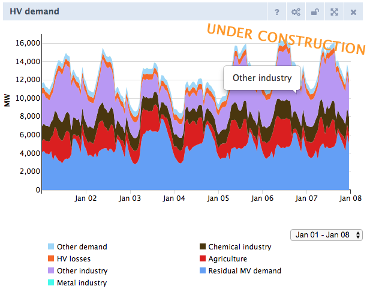
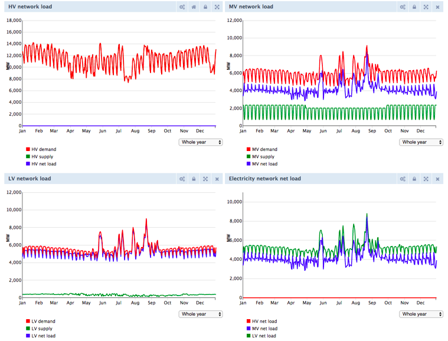
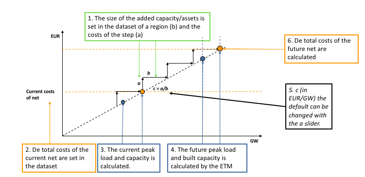

# Network impact calculation (Currently under validation) 

The network impact calculation is a module that currently only works for the Dutch version of the ETM. The calculation determines the investment required in the electricity grid depending on the choices made by the users. For example, in a scenario with a large share of electric heaters the capacity of the current electricity grid is not sufficient to transport all demand.

The results of the network impact calculation are displayed in a chart in the front end of the model (‘Required additional infrastructure investments’). This chart shows the total additional investment required in the electricity grid for the current scenario. In addition, the annualized investment costs including operation and maintenance costs and interest for the required network expansion are  included in the costs dashboard item in the front end of the model.

This network calculation is commissioned and supervised by Netbeheer Nederland.

## Goal & Scope:
*	The network calculation in the Energy transition model must provide an initial insight into the grid reinforcement associated with an energy scenario.

*	The target group of the network calculation is the average user of the ETM.

*	The network calculation does not have the goal of achieving the same level of detail as the tools of different network operators.

Network calculation definitions
-------------------------------

To better understand the network calculation a few definitions are required:

**Peak load**

Peak load refers to the maximum load that occurs in a given period of time. In the ETM four periods of time are considered: summer day, summer evening, winter day, and winter evening. Depending on the technology and how it is used, the peak load values vary for each period. *Example*: Solar panels will have the largest peak load during the early afternoon of a summer day. During a summer evening or a winter day solar panels might still produce electricity however the peak load for these time periods will be lower. For network impact calculations peak loads are of interest because cables and transformers have a maximum capacity and as long as the maximum load is lower than the available capacity no network expansion is required (i.e. the amount of energy flow over a period of time is irrelevant).

**Peak load delta**

The change in the peak load is called the peak load delta. The network impact calculation is a comparison calculation; the required network expansion is determined by how much the peak load changes with respect to the current situation.

**Capacity**

Cables and transformers have a maximum capacity; they can only carry so much electricity at any instant. Capacity is expressed in Volt-Ampere, the units for complex power. In the ETM Mega Volt (MV) is often used. For the ETM it is sufficient to consider the real power (MW) although in reality the complex power Mega Volt-Ampere (MVA) and is slightly larger than the real power.

## Calculation in steps:
The network calculation consists of four different steps: Dynamic demand curve, peak load calculation, required net calculation, and cost calculation. 

### Step 1: Dynamic demand curve
The first step of the network calculation is the addition of the new technologies to the dynamic demand curve. We have the hourly profiles of the technologies and ordered these profiles to different net levels. 

 
### Step 2: Peak load calculation per net level
The second step in the netwerk calculation is the peak load calculation per net level (LV, LV/MV, MV, MV/HV, and HV). With this calculation we want to find the used capacity of the network.

*	LV-net: The used LV capacity is calculated by the maximum net peak on the LV net. This is the hour that the difference between supply and demand is the largest.
*	LV/MV transformers: The used capacity for the LV/MV transformer is equal to the needed capacity for the LV net.
*	MV-net: The used capacity of the MV network is calculated by the supply and demand directly at the MV level. This is the same as the calculation at the LV net, except that this also includes the hourly residual demand-supply from the LV net.  
*	MV/HV transformers: The used capacity for the LV/MV transformer is equal to the needed capacity for the MV net.
*	HV-net: The used capacity for the HV network is calculated by the max total demand or total supply on the HV level. A net calculation would always be '0', because the dispatchables would fill up all differences.

### Step 3: Required net calculation
In the dataset which describes a region there are step sizes defined per net level. This means that when capacity needs to be built, that it is built with a certain capacity step. Per net level the following steps are followed to calculate the required capacity: 

*	Calculation of capacity of net present, by using a given % of spare capacity:

	* Net capacity present = net peak load present / (100% - net spare capacity)
	
	

*	IF the future peak is larger than the usable capacity:

	* IF (net level peak load future > net level capacity present),

*	THEN calculate the new capacity of the future net, with taking in account certain step sizes: 
net level capacity future = net level capacity present + net level capacity per step size * net level new step sizes needed

	* net level capacity per step size = A fixed step size when you need to increase the capacity of the net. This step size is based on 2 KW extra capacity per household. The steps at the lv net are based on 100 houses (200 KW), the mv net on 1000 household (2 MW), and the hv net on 10.000 households (20 MW). 

	* net level new step sizes needed = The CEIL of: (net level peak load future - net level capacity present) / net level capacity per step size

### Step 4: Cost calculation
The costs calculation calculates the total investment costs and the yearly costs of capital, operation and maintenance (CAPEX and OPEX).

The costs calculation uses two main inputs for CAPEX: 
*	**Total built capacity**: The former capacity calculation offers the total built capacity per net level. This built capacity is the input for the costs calculation.
*	**Costs per capacity**: In the dataset which describes a region there are costs per step sizes defined per net level. This means that when capacity needs to be built, that a single step has certain in euro per KW.

These two inputs multiplied give the total investment costs. Together with the lifetime and the weighted average costs of capital, the yearly costs of capital are calculated. When the operation and maintenance costs are added the total yearly costs of the electricity new are calculated per net level. 

