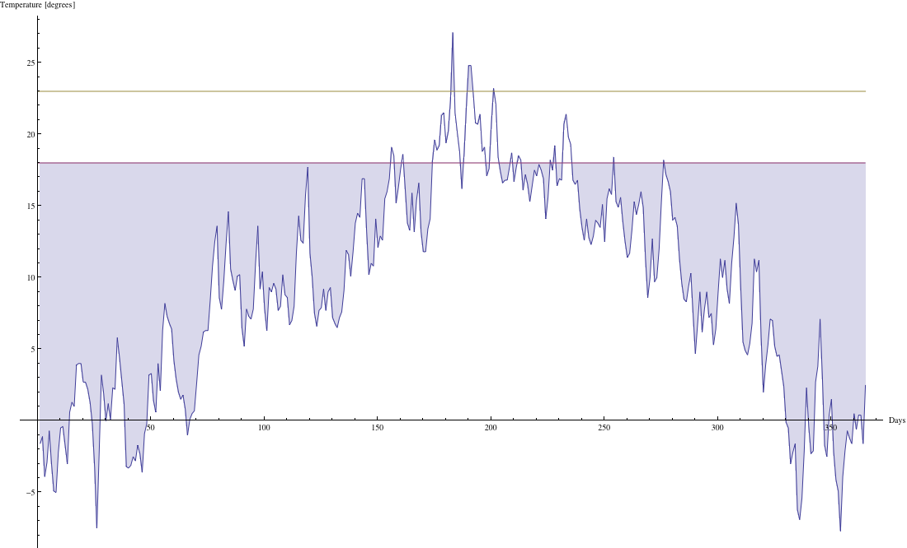
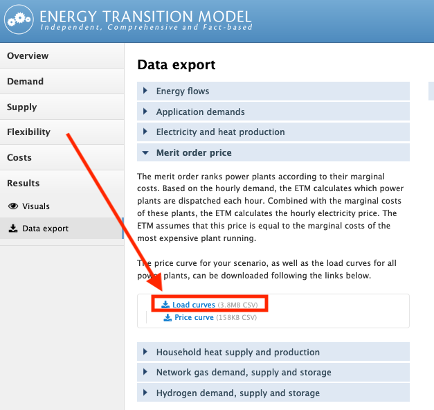

#Weather conditions

ETM allows users to set weather conditions.
For all datasets the average temperature and full load hours of wind turbines and solar pv can be adjusted.
For The Netherlands it is possible to select one of three weather years with extreme weather conditions to explore the effect of these conditions. Below these features are explained.

## Temperature
Users can adjust the average temperature. The outdoor temperature slider sets the temperature with respect to the start year. This change in average temperature results in a change in heating and cooling demand.

To translate a temperature change into a change in useful demand, it is assumed that people will start heating their homes when the outside temperature drops beneath 18 °C and will cool their homes when it rises above 23 °C. The change in useful demand for heating and cooling is directly related to a change in degree-days [1](http://en.wikipedia.org/wiki/Degree_day). To find the relation between the average outdoor temperature and the degree-days we have used temperature measurements from the observatory at "De Bilt" in the Netherlands for the year 2010. Figure 1 below shows these temperature measurements in degrees centigrade. Also plotted are the threshold temperatures above and below which we assume cooling and heating is required.

*Figure 1: Temperature curve in the Bilt for 2010*

To calculate degree-days for a given temperature threshold, the area between the threshold temperature and the curve is integrated. For heating this is the area **under** the 18 degree threshold and **above** the curve (shaded area in figure 1).Shifting the whole curve up (for increasing outdoor temperatures) or down (for decreasing outdoor temperatures) changes the shaded areas and thus the degree-days. 

<!--
The Figures below show the surface areas for heating (left Figure) and cooling (right Figure) as a function of temperature change (with respect to the 2010 average).

*Figure 2: Effect of average temperature on heating demand* 

*Figure 3: Effect of average temperature on cooling demand*

The functional relations described above are used to scale the useful demand for heating and cooling. For heating the functional relation is almost linear. For cooling, it is strongly non-linear with demand almost vanishing for a 5 degree drop in temperature and increasing more than tenfold for a five degree increase. This is a result of the fact that the cooling threshold temperature is only slightly below the maximum temperature measured at De Bilt (see Figure 1.). The surface area (and thus the degree-days) associated with cooling essentially describes the high temperature 'peak' of the temperature curve and is therefore very sensitive to temperature changes. -->

Please note that the effects of insulation are taken into account separately in the ETM. The slider described in this text, directly changes the useful demand for heating and cooling and the resulting useful demand can be (further) diminished by effects of insulation.

## Full load hours
The default full load hours (FLH) in the ETM are based on currently installed technologies. Because of technological developments it is likely that future wind turbines and solar PV may produce more electricity per installed capacity than today. FLH's can also vary regionally.

Changing the FLH's results in a change in annual produced electricity and shape of the production curves. For wind turbines the peaks will become broader and flatter with increasing full load hours as the turbine spends more time running at higher capacity. For solar the default curve is interpolated with a curve for Spain, a country with high (1361) FLH for solar PV. Take a look at the *‘Electricity production per hour’*-chart to see the effect of your changes on the production profiles.

The production profiles can be downloaded as csv-files in the *Data export*-section of the ETM: Results > Data export > Merit order price > Load curves.

*Figure 2: Production curves can be downloaded in the Data export-section of the ETM*

## Weather conditions
*This feature is currently only available for (regions in) The Netherlands.*

The Netherlands have experienced extreme cold periods in the past, as well as periods with little wind and sun. This may happen again in the future, and low temperatures may negatively affect the ability for air and hybrid heat pumps to satisfy demand. Besides that, a lack of wind and sun may negatively affect the electricity production from wind and solar power. To explore these effects for a scenario for (a region within) the Netherlands a year with extreme weather conditions can be selected.

The temperature, heat demand and production curves for all weather years can be downloaded from [ETSource - curves - weather](https://github.com/quintel/etsource/tree/master/datasets/nl/curves/weather). The file `weather_properties.csv` provides FLH for every technology and average temperature with respect to the base year. 

The ETM contains hourly demand and production curves. The methods to create curves for weather years differ from the standard methods. Below we explain those differences. More information about the default curves can be found on [ETDataset - curves](https://github.com/quintel/etdataset-public/tree/master/curves). 

### Wind
The default wind production curves which are based on measured production data provided by the Open Power System Data platform (read more about [wind curves](https://github.com/quintel/etdataset-public/blob/master/curves/supply/wind/README.md)) are not available for the weather years (1987, 1997, 2004). That is why we use measured wind data and convert that to production. Detailed documentation on sources and methods used to created wind curves for the weather years can be found on
[ETDataset - curves wind - weather years](https://github.com/quintel/etdataset-public/tree/master/curves/supply/wind/script/weather_years).

### Solar PV
The default solar PV production curves which are based on measured production data provided by the Open Power System Data platform (read more about [solar curves](https://github.com/quintel/etdataset-public/blob/master/curves/supply/solar/README.md)) are not available for the weather years (1987, 1997, 2004).

For weather years we use measured irradiation data (Source: [KNMI](https://projects.knmi.nl/klimatologie/uurgegevens/selectie.cgi)). The shape of the curve equals the shape of irradiation data. Full load hours for solar PV are based on the total solar irradiation of the weather year. FLH of the weather year are determined using information about total solar irradiation and FLH of the reference year 2015. More information can be found on [ETDataset - curves solar - weather years](https://github.com/quintel/etdataset/tree/master/curves/supply/solar/script/weather_years).

### Temperature
Just as for default setting for weather years temperature curves are based on measured data from The Bilt. (Source: [KNMI](https://projects.knmi.nl/klimatologie/uurgegevens/selectie.cgi)). For each weather year the average temperature is compared with the average temperature of the default year. If a user selects a weather year this value is used to set the temperature slider.

### Space heating
Weather years use the [standard method](https://github.com/quintel/etdataset-public/tree/master/curves/demand/households/space_heating) to construct space heating curves. 

## Discussion
Feedback on the weather years is very welcome!
If you have a comment or a suggestion please let us know, you can:

* [Open an issue in ETDataset](https://github.com/quintel/etdataset-public/issues/new) and assign a team member of Quintel, e.g.:
	* [Chael Kruip](https://github.com/chaelkruip)
	* [Dorine van der Vlies](https://github.com/dorinevandervlies)
	* [Marlieke Verweij](https://github.com/marliekeverweij)
	* [Roos de Kok](https://github.com/redekok) 
* E-mail us: [info@quintel.com](info@quintel.com)
