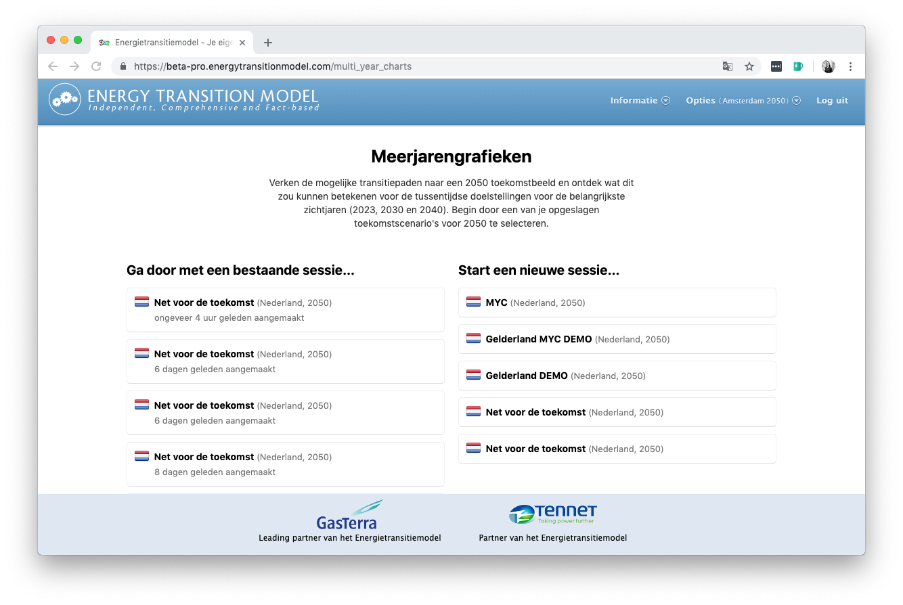
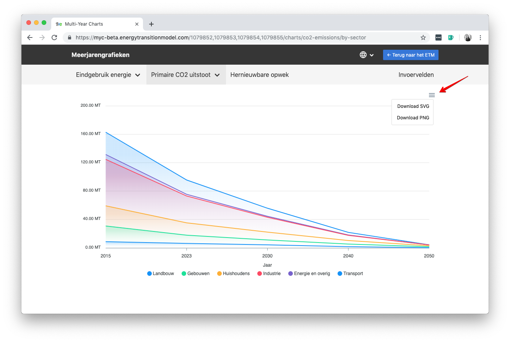
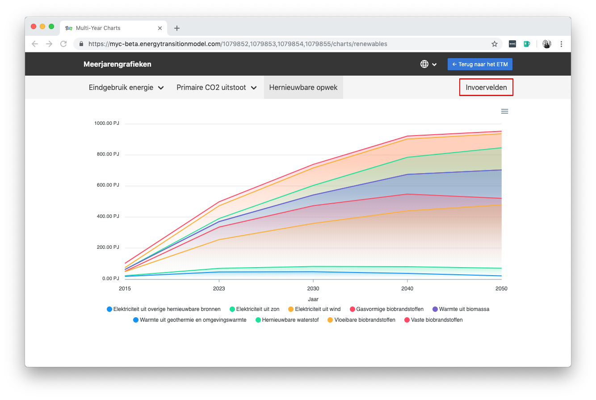
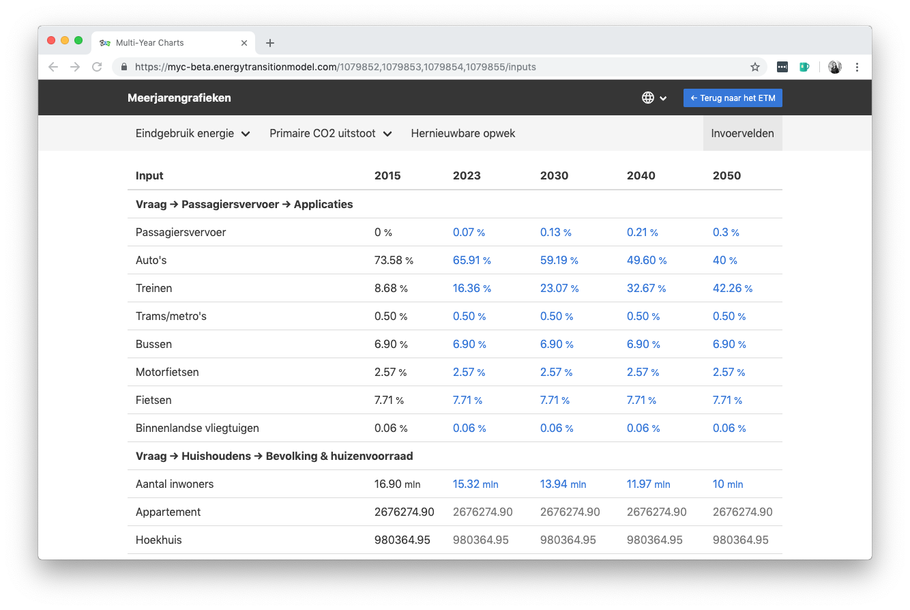
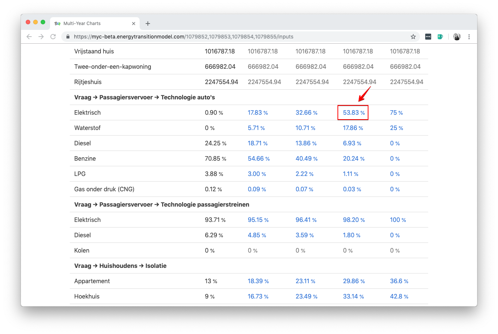
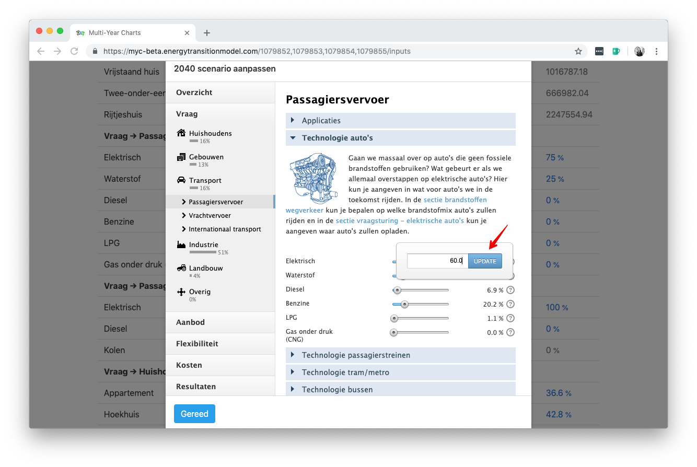
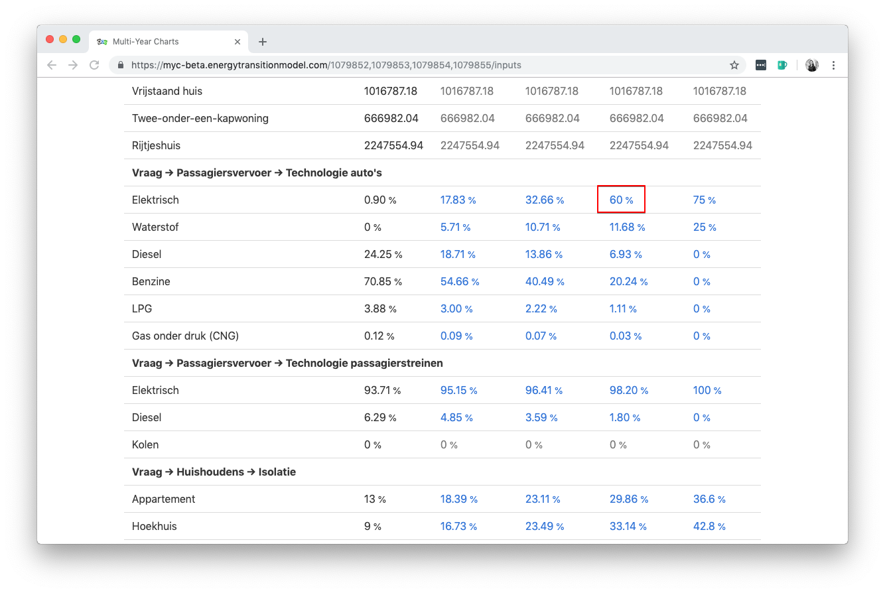

# Meerjarengrafieken

[Link](https://beta-pro.energytransitionmodel.com/multi_year_charts) naar de interface 
[Link](https://github.com/quintel/multi-year-charts) naar de (private) Github repository

### Achtergrond

Het Energietransitiemodel (ETM) wordt onder andere gebruikt om toekomstbeelden voor gemeentes en regio's te verkennen. De volgende uitdaging waar de provincie, gemeenten en regio's voor staan is het opstellen van de Regionale Energiestrategieën (RESsen) waarvan de eerste versies medio 2019 klaar moeten zijn. Met de inzet van het ETM kan het opstellen van de RES ondersteund worden. Deze ondersteuning bestaat uit het in kaart brengen van het samenhangende 'energieplaatje' voor alle sectoren op RES-regio niveau voor verschillende zichtjaren. Belanghebbenden, zoals provincies of RES-regio's, hebben aangegeven dat niet alleen het eindbeeld voor het toekomstjaar (bijv. 2050) belangrijk is, maar ook verschillende zichtjaren op het transitiepad naar dit eindbeeld. De belangrijkste zichtjaren op het transitiepad zijn 2023, 2030 en 2040, niet in de laatste plaats omdat voor deze tussenjaren ook doelstellingen op het vlak van CO2-reductie zijn afgesproken. Met de meerjarengrafiekeninterface krijgt de gebruiker inzicht in een drietal grafieken waarmee het transitiepad van de belangrijkste aspecten van het energiesysteem ingezien en aangepast kan worden.

### Functionaliteiten

De interface beschikt over onderstaande functionaliteiten:

1. Openen van een 2050 scenario in de interface
2. Drietal grafieken met verschillende zichtjaren
    * Eindgebruik energie (uitgesplitst naar sector en/of energiedrager-groep)
    * CO2-uitstoot (uitgesplitst naar sector en/of energiedrager-groep)
    * Herkomst van de opgewekte energie (uitgesplitst naar energiedrager-groep)
3. Invoervelden om keuzes te maken voor de verschillende zichtjaren
4. Opslaan en delen van sessies

### Hoe werkt het?

Hieronder staat per functionaliteit een korte uitleg beschreven:  

##### 1. Openen van een 2050 scenario in de interface

Ga naar de [BETA-versie](https://beta-pro.energytransitionmodel.com/) van het Energietransitiemodel en klik op ['Probeer nu'](https://beta-pro.energytransitionmodel.com/multi_year_charts) onder de Multi-year charts.

Om de meerjarengrafiekeninterface te gebruiken, wordt de gebruiker gevraagd om in te loggen. Zodra er succesvol ingelogd is, worden er twee lijsten met scenario's/sessies getoond. De gebruiker kan er voor kiezen om door te gaan met een bestaande sessie (links) of om een nieuwe sessie te starten (rechts). Door een van de (2050) scenario's aan te klikken, wordt de meerjarengrafiekeninterface geopend.

##### 2. Drietal grafieken met verschillende zichtjaren
In de interface wordt een drietal grafieken getoond: eindgebruik energie (uitgesplitst naar sector en/of energiedrager-groep), CO2uitstoot (uitgesplitst naar sector en/of energiedrager-groep), en herkomst van de opgewekte energie (uitgesplitst naar energiedrager-groep). Voor elke grafiek worden de datapunten voor het startjaar (2015) en toekomstjaar (2050) overgenomen uit het onderliggende scenario. De datapunten voor de zichtjaren op het transitiepad (2023, 2030 en 2040) worden lineair geïnterpoleerd tussen de waarden van het start- en toekomstjaar. 

Door de cursor over de grafiek te bewegen, kan de gebruiker middels een tooltip inzicht krijgen in de verschillende datapunten. Rechtsboven kan de gebruiker ervoor kiezen om de getoonde grafiek als SVG- of PNG-bestand te downloaden. 

Indien de gebruiker de waarden voor de verschillende zichtjaren en/of het toekomstjaar wil aanpassen, kan dat door naar de 'Invoervelden' pagina te navigeren.

##### 3. Invoervelden om keuzes te maken voor de verschillende zichtjaren
Via de invoervelden kunnen de onderliggende waarden voor de invoervelden voor alle jaren aangepast worden op basis van de afgesproken doelstellingen per zichtjaar. De invoervelden zijn gegroepeerd volgens de onderliggende structuur van het Energietransitiemodel. De verschillende kleuren van de waarden geven aan of deze ten opzichte van het startjaar is aangepast: een blauwe waarde is aangepast, een grijze waarde niet. 

Door op een waarde te klikken, wordt een vereenvoudigde versie van het Energietransitiemodel geopend waar de gebruiker de schuifjes kan updaten voor het desbetreffende jaar. Zodra alle aanpassingen zijn doorgevoerd, kunnen de instellingen opgeslagen worden door linksonder op 'Gereed' te klikken. De waarde is dan ook aangepast in het overzicht van alle invoervelden en daarmee ook in de meerjarengrafieken.

##### 4. Opslaan en delen van sessies

De meerjarengrafieken sessies worden automatisch opgeslagen. Om later verder te gaan met een sessie, kan de gebruiker links in het startscherm (onder "Ga door met een bestaande sessie..") de desbetreffende sessie opzoeken en openen. 

Om een sessie te delen met anderen, kan de gebruiker de bijbehorende link doorsturen. In dit voorbeeld is dat dus de volgende URL: https://myc-beta.energytransitionmodel.com/1079852,1079853,1079854,1079855.

 
